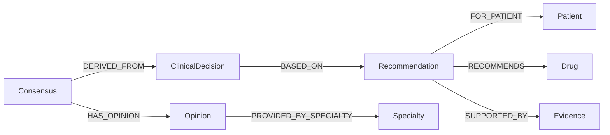

# Clinical Graph Event Schema v1

> **规范版本：1.0**
>
> 本文件定义 AI-Kill-Cancer 与 KnowGraphGo 之间用于 Clinical Graph 构建的 Canonical Event Schema。
> Python Event Service、Go Adapter 与 E2E fixture 均以此 schema 为准。

---

## 目录

1. [Event Envelope](#1-event-envelope)
2. [Patient Payload](#2-patient-payload)
3. [Recommendation Payload](#3-recommendation-payload)
4. [Clinical Decision Payload](#4-clinical-decision-payload)
5. [Consensus Payload](#5-consensus-payload)
6. [Normalization 规则](#6-normalization-规则)
7. [Required Fields 总表](#7-required-fields-总表)
8. [Optional Fields 总表](#8-optional-fields-总表)
9. [Sensitive Fields Forbidden](#9-sensitive-fields-forbidden)
10. [Graph Relation 方向](#10-graph-relation-方向)
11. [Relation Properties (Provenance)](#11-relation-properties-provenance)

---

## 1. Event Envelope

每个事件都是一个 JSON 对象，顶层包含以下字段：

```json
{
  "event_id": "evt-{aggregate_id}-{event_type}-{timestamp}",
  "event_type": "patient.created | patient.updated | recommendation.created | clinical_decision.created | tumor_board_consensus.created",
  "aggregate_type": "patient | recommendation | clinical_decision | tumor_board_consensus",
  "aggregate_id": "P001 | REC-001 | DC-001 | CON-001",
  "occurred_at": "2026-07-27T00:00:00Z",
  "correlation_id": "corr-P001",
  "causation_id": "evt-REC-001",
  "payload": { }
}
```

### Envelope 字段说明

| 字段 | 类型 | 必需 | 说明 |
|------|------|------|------|
| `event_id` | string | **是** | 全局唯一事件 ID。格式：`evt-{aggregate_id}-{event_type}-{unix_timestamp}` |
| `event_type` | string | **是** | 事件类型。枚举值见下方 |
| `aggregate_type` | string | **是** | 聚合类型。小写 snake_case |
| `aggregate_id` | string | **是** | 聚合的业务主键 |
| `occurred_at` | string | **是** | ISO 8601 时间戳（UTC） |
| `correlation_id` | string | 否 | 关联 ID，用于追踪事件链 |
| `causation_id` | string | 否 | 触发本事件的上一个事件 ID |
| `payload` | object | **是** | 事件载荷，结构由 event_type 决定 |

### Event Type 枚举

| event_type | 说明 |
|------------|------|
| `patient.created` | 新增患者记录 |
| `patient.updated` | 更新患者信息 |
| `recommendation.created` | 新增治疗建议 |
| `clinical_decision.created` | 新增临床决策 |
| `tumor_board_consensus.created` | 新增肿瘤委员会共识 |

---

## 2. Patient Payload

适用于 `patient.created` 和 `patient.updated`。

```json
{
  "patient_id": "P001",
  "display_name": "ANON",
  "sex": "F",
  "age_range": "40-50",
  "cancer_type": "BRCA",
  "source_system": "EHR",
  "source_id": "SRC-001"
}
```

| 字段 | 类型 | 必需 | 说明 |
|------|------|------|------|
| `patient_id` | string | **是** | 患者业务主键 |
| `display_name` | string | **是** | 显示名称。**必须支持 Stub 值 `ANON`** |
| `sex` | string | **是** | 性别：`M` / `F` |
| `age_range` | string | **是** | 年龄范围，如 `40-50` |
| `cancer_type` | string | **是** | 癌症类型代码，如 `BRCA` |
| `source_system` | string | **是** | 来源系统标识 |
| `source_id` | string | **是** | 来源系统内的 ID |

---

## 3. Recommendation Payload

适用于 `recommendation.created`。

```json
{
  "recommendation_id": "REC-001",
  "patient_id": "P001",
  "title": "Recommendation for P001",
  "recommended_drugs": [
    {
      "drug_id": "DRUG-001",
      "drug_name": "Olaparib",
      "rank": 1,
      "score": 0.95
    }
  ],
  "evidence_references": [
    {
      "evidence_id": "EV-001",
      "citation": "Study XYZ",
      "evidence_level": "high",
      "confidence": 0.9
    }
  ],
  "rank": 1,
  "score": 0.95
}
```

| 字段 | 类型 | 必需 | 说明 |
|------|------|------|------|
| `recommendation_id` | string | **是** | 建议业务主键 |
| `patient_id` | string | **是** | 关联的患者 ID |
| `title` | string | **是** | 建议标题 |
| `recommended_drugs` | array | **是** | 推荐药物列表（Canonical 字段） |
| `recommended_drugs[].drug_id` | string | **是** | 药物 ID |
| `recommended_drugs[].drug_name` | string | 推荐 | 药物名称 |
| `recommended_drugs[].rank` | number | 否 | 优先级排序 |
| `recommended_drugs[].score` | number | 否 | 置信度分数 |
| `evidence_references` | array | **是** | 证据引用列表（Canonical 字段） |
| `evidence_references[].evidence_id` | string | **是** | 证据 ID |
| `evidence_references[].citation` | string | 推荐 | 引用信息 |
| `evidence_references[].evidence_level` | string | 否 | 证据等级 |
| `evidence_references[].confidence` | number | 否 | 置信度 |
| `rank` | number | 否 | 建议优先级 |
| `score` | number | 否 | 建议评分 |

### 向后兼容字段

Go Adapter **可以**同时识别以下旧字段：

```json
{
  "drug_ids": ["DRUG-001"],
  "evidence_ids": ["EV-001"]
}
```

但正式 E2E **必须**使用 Canonical 字段 `recommended_drugs` / `evidence_references`。

---

## 4. Clinical Decision Payload

适用于 `clinical_decision.created`。

```json
{
  "decision_id": "DC-001",
  "patient_id": "P001",
  "recommendation_id": "REC-001",
  "decision_type": "APPROVED",
  "description": "Clinical decision for P001",
  "rationale": "Based on guidelines",
  "evidence_references": [
    {
      "evidence_id": "EV-001",
      "citation": "Study XYZ"
    }
  ]
}
```

| 字段 | 类型 | 必需 | 说明 |
|------|------|------|------|
| `decision_id` | string | **是** | 决策业务主键 |
| `patient_id` | string | **是** | 关联的患者 ID |
| `recommendation_id` | string | **是** | 关联的建议 ID |
| `decision_type` | string | **是** | 决策类型：`APPROVED` / `REJECTED` / `PENDING` |
| `description` | string | **是** | 决策描述 |
| `rationale` | string | 推荐 | 决策依据 |
| `evidence_references` | array | **是** | 证据引用列表（Canonical 字段） |
| `evidence_references[].evidence_id` | string | **是** | 证据 ID |
| `evidence_references[].citation` | string | 推荐 | 引用信息 |

---

## 5. Consensus Payload

适用于 `tumor_board_consensus.created`。

```json
{
  "consensus_id": "CON-001",
  "patient_id": "P001",
  "clinical_decision_id": "DC-001",
  "final_recommendation": "Approve Olaparib",
  "consensus_status": "AGREED",
  "consensus_score": 0.92,
  "supporting_evidence": [
    {
      "evidence_id": "EV-001"
    }
  ],
  "specialist_opinions": [
    {
      "opinion_id": "OP-001",
      "specialist": "Dr. Smith",
      "specialty": "ONCOLOGY",
      "content": "Agree with recommendation"
    }
  ],
  "participating_specialties": ["ONCOLOGY", "RADIOLOGY"]
}
```

| 字段 | 类型 | 必需 | 说明 |
|------|------|------|------|
| `consensus_id` | string | **是** | 共识业务主键 |
| `patient_id` | string | **是** | 关联的患者 ID |
| `clinical_decision_id` | string | **是** | 关联的临床决策 ID |
| `final_recommendation` | string | **是** | 最终建议文本 |
| `consensus_status` | string | **是** | 共识状态：`AGREED` / `PARTIAL` / `DISAGREED` |
| `consensus_score` | number | 推荐 | 共识分数 (0.0–1.0) |
| `supporting_evidence` | array | **是** | 支持证据列表（Canonical 字段） |
| `supporting_evidence[].evidence_id` | string | **是** | 证据 ID |
| `specialist_opinions` | array | **是** | 专家意见列表（Canonical 字段） |
| `specialist_opinions[].opinion_id` | string | **是** | 意见 ID |
| `specialist_opinions[].specialist` | string | 推荐 | 专家姓名 |
| `specialist_opinions[].specialty` | string | **是** | 专科领域，如 `ONCOLOGY` |
| `specialist_opinions[].content` | string | 推荐 | 意见内容 |
| `participating_specialties` | array | 否 | 参与专科列表 |

---

## 6. Normalization 规则

### 6.1 Entity Kind 命名

| Payload 中的 aggregate_type | Graph Entity Kind |
|---------------------------|-------------------|
| `patient` | `patient` |
| `recommendation` | `recommendation` |
| `clinical_decision` | `clinical_decision` |
| `tumor_board_consensus` | `consensus` |
| (from `recommended_drugs`) | `drug` |
| (from `evidence_references` / `supporting_evidence`) | `evidence` |
| (from `specialist_opinions`) | `opinion` |
| (from `specialist_opinions[].specialty`) | `specialty` |

### 6.2 Relation Kind 命名

| 从 | 到 | Relation Kind | 说明 |
|----|----|---------------|------|
| `recommendation` | `patient` | `FOR_PATIENT` | 建议对应患者 |
| `clinical_decision` | `recommendation` | `BASED_ON` | 决策基于建议 |
| `consensus` | `clinical_decision` | `DERIVED_FROM` | 共识衍生自决策 |
| `recommendation` | `drug` | `RECOMMENDS` | 建议推荐药物 |
| `recommendation` | `evidence` | `SUPPORTED_BY` | 建议受证据支持 |
| `consensus` | `opinion` | `HAS_OPINION` | 共识包含专家意见 |
| `opinion` | `specialty` | `PROVIDED_BY_SPECIALTY` | 意见来自专科 |

### 6.3 ID 生成

所有 Graph ID 使用 UUIDv5（确定性哈希）：

- Namespace: `a7b4e5c2-8d9f-4a3b-8c1d-6e9f2a7b3c5d`
- 输入：`{kind}:{business_key}`（例如 `patient:P001`）
- Go：`uuid.NewSHA1(ClinicalNamespace, []byte(canonical))`
- Python：`uuid.uuid5(CLINICAL_NAMESPACE, canonical)`

### 6.4 字段映射

推荐药物中的 `drug_id` → Graph Entity `drug` 的 business key `drug_id`。
证据引用中的 `evidence_id` → Graph Entity `evidence` 的 business key `evidence_id`。
专家意见中的 `opinion_id` → Graph Entity `opinion` 的 business key `opinion_id`。
专家意见中的 `specialty` → Graph Entity `specialty` 的 business key `specialty`。

### 6.5 Stub 保护

当 `patient.created` 事件已创建完整 Patient 后，
后续 `recommendation.created` 事件**不得**覆盖 Patient 的以下字段：

- `display_name`
- `sex`
- `age_range`
- `cancer_type`

仅当系统确定 Patient 已通过 `patient.created` 完整注册时，才允许跳过更新；
如果 Patient 不存在（stub 场景），则用缺省值补全，但已有值不得被覆盖。

---

## 7. Required Fields 总表

以下字段在对应事件类型中为 **必需**，缺失会导致事件拒绝：

| 事件类型 | 必需字段 |
|----------|---------|
| `patient.created` / `patient.updated` | `patient_id`, `display_name`, `sex`, `age_range`, `cancer_type`, `source_system`, `source_id` |
| `recommendation.created` | `recommendation_id`, `patient_id`, `title`, `recommended_drugs[].drug_id`, `evidence_references[].evidence_id` |
| `clinical_decision.created` | `decision_id`, `patient_id`, `recommendation_id`, `decision_type`, `description`, `evidence_references[].evidence_id` |
| `tumor_board_consensus.created` | `consensus_id`, `patient_id`, `clinical_decision_id`, `final_recommendation`, `consensus_status`, `supporting_evidence[].evidence_id`, `specialist_opinions[].opinion_id`, `specialist_opinions[].specialty` |

---

## 8. Optional Fields 总表

以下字段为可选，缺失时应用缺省值或留空：

| 事件类型 | 可选字段 | 缺省值 |
|----------|---------|--------|
| 所有 | `correlation_id` | `null` |
| 所有 | `causation_id` | `null` |
| `recommendation.created` | `rank`, `score` | `null` / `0` |
| `recommendation.created` | `recommended_drugs[].drug_name`, `recommended_drugs[].rank`, `recommended_drugs[].score` | `null` |
| `recommendation.created` | `evidence_references[].citation`, `evidence_references[].evidence_level`, `evidence_references[].confidence` | `null` |
| `clinical_decision.created` | `rationale` | `null` |
| `clinical_decision.created` | `evidence_references[].citation` | `null` |
| `tumor_board_consensus.created` | `consensus_score`, `participating_specialties` | `null` / `[]` |
| `tumor_board_consensus.created` | `specialist_opinions[].specialist`, `specialist_opinions[].content` | `null` |

---

## 9. Sensitive Fields Forbidden

以下敏感字段**不得**出现在任何 Event Payload 中：

| 类别 | 禁止字段 |
|------|---------|
| 个人身份信息 (PII) | `ssn`, `passport_number`, `national_id`, `full_address`, `phone_number`, `email` |
| 财务信息 | `credit_card`, `bank_account`, `insurance_id` |
| 生物识别 | `fingerprint_hash`, `facial_recognition_data`, `genetic_sequence` |
| 访问凭证 | `password`, `token`, `api_key`, `secret` |
| 临床自由文本 | `free_text_diagnosis`, `raw_notes`, `unstructured_report` |

**合规要求：**

1. 所有患者标识使用业务主键 `patient_id`，不得使用真实姓名或身份证号。
2. `display_name` 字段仅允许匿名化名称（正式场景应为 `ANON` 或类似占位符）。
3. 所有事件 payload 在写入 Graph 前应经过 schema validation。
4. 任何包含禁止字段的事件将被拒绝，并返回 validation error。

---

## 10. Graph Relation 方向

Graph 中的 Relation 方向定义如下（箭头方向 = 有向边方向）：



### 查询方向

使用 `query path` 命令时，**from → to 方向应与 Graph Relation 方向一致**：

| 路径 | 方向 | 期望的 Relation Kind |
|------|------|---------------------|
| Recommendation → Patient | REC → PAT | `FOR_PATIENT` |
| ClinicalDecision → Recommendation | DEC → REC | `BASED_ON` |
| Consensus → ClinicalDecision | CON → DEC | `DERIVED_FROM` |
| Recommendation → Drug | REC → DRUG | `RECOMMENDS` |
| Recommendation → Evidence | REC → EVI | `SUPPORTED_BY` |
| Consensus → Opinion | CON → OP | `HAS_OPINION` |
| Opinion → Specialty | OP → SPEC | `PROVIDED_BY_SPECIALTY` |

---

## 11. Relation Properties (Provenance)

每条 Relation 在 Graph Store 中存储以下 Provenance Properties：

| 属性 | 来源 | 说明 |
|------|------|------|
| `source_system` | Event Envelope 或 Payload | 来源系统标识 |
| `event_id` | Event Envelope | 触发 Relation 创建的事件 ID |
| `event_type` | Event Envelope | 事件类型 |
| `aggregate_type` | Event Envelope | 聚合类型 |
| `aggregate_id` | Event Envelope | 聚合 ID |
| `correlation_id` | Event Envelope（可选） | 关联 ID |
| `causation_id` | Event Envelope（可选） | 因果 ID |
| `occurred_at` | Event Envelope | 事件发生时间 |

这些属性使每条 Relation 可溯源到触发它的原始事件，满足数据谱系（Data Provenance）要求。

---

## 版本历史

| 版本 | 日期 | 变更 |
|------|------|------|
| 1.0 | 2026-07-27 | 初始规范。定义 Event Envelope、Patient / Recommendation / Decision / Consensus Payload、Normalization、Required / Optional / Forbidden Fields、Graph Relation Direction、Relation Provenance |
