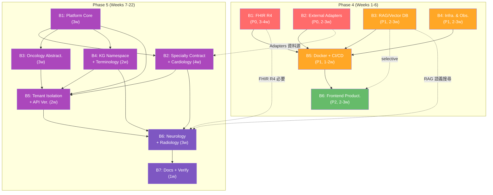

# Phase 4 & Phase 5 Dependency Map

> **產出時間**：2026-08-01  
> **基於文件**：`tasks/plan-phase4-clinical-ai-productization.md`、`tasks/plan-phase5-medical-ai-platform.md`、`tasks/research/phase4-phase5-gap-analysis.md`  
> **負責角色**：doc-writer  

---

## 目錄

1. [依賴分類圖例](#1-依賴分類圖例)
2. [Phase 4 Batch 依賴總圖](#2-phase-4-batch-依賴總圖)
3. [Phase 4 詳細依賴矩陣](#3-phase-4-詳細依賴矩陣)
4. [Phase 5 Batch 依賴總圖](#4-phase-5-batch-依賴總圖)
5. [Phase 5 詳細依賴矩陣](#5-phase-5-詳細依賴矩陣)
6. [Phase 4 → Phase 5 跨期依賴](#6-phase-4--phase-5-跨期依賴)
7. [關鍵依賴鏈（Critical Path）](#7-關鍵依賴鏈critical-path)
8. [並行組合建議](#8-並行組合建議)
9. [風險緩解](#9-風險緩解)
10. [外部標準／資料／安全依賴一覽](#10-外部標準資料安全依賴一覽)
11. [Gap Analysis → Master Plan 對應矩陣](#11-gap-analysis--master-plan-對應矩陣)

---

## 1. 依賴分類圖例

| 標記 | 含義 |
|------|------|
| **🔀 可並行** | 與其他 Batch 無依賴關係，可同時開發 |
| **➡️ 必須串行** | 有嚴格前置依賴，需等前置完成 |
| **🔒 Phase 4 必須完成** | Phase 5 的某些 Batch 必須等 Phase 4 完成 |
| **📅 可延後 Phase 5** | 不影響 Phase 4 交付，可排入 Phase 5 |
| **🌐 外部標準依賴** | 依賴 FHIR/HL7/NCCN 等外部標準或 API |
| **🗄️ 資料依賴** | 依賴特定資料來源或格式 |
| **🔄 Migration 依賴** | 依賴資料庫遷移順序 |
| **🔐 Security 依賴** | 依賴安全審查或授權機制 |

---

## 2. Phase 4 Batch 依賴總圖

```
Phase 4 整體時程預估：10-17 週
══════════════════════════════════════════════════════════════════

              ┌─────────────────────────────────────────────────┐
              │              Phase 4 啟動 Gate                  │
              │  ┌─ 既有 Phase 3 功能齊全                     │
              │  └─ 所有既有 test suite pass (~148 tests)     │
              └─────────────────────┬───────────────────────────┘
                                    │
         ┌──────────────────────────┼──────────────────────────┐
         ▼                          ▼                          ▼
   ┌───────────┐             ┌───────────┐             ┌───────────┐
   │  B1 ★     │             │  B2 ★     │             │  B3 ★     │
   │ FHIR R4   │             │ External  │             │RAG/Vector │
   │ 互通      │             │ Adapters  │             │    DB     │
   └─────┬─────┘             └─────┬─────┘             └─────┬─────┘
         │                        │                        │
         │              ┌─────────┤                        │
         ▼              ▼         ▼                        ▼
   ┌───────────┐   ┌───────────┐                   ┌───────────┐
   │ B4 ★      │   │ OpenCRA-  │                   │ B6 (部分) │
   │Infrastruc-│   │ VAT       │                   │Knowledge- │
   │ture & Obs.│   │ (B2 子項) │                   │Base 整合  │
   └─────┬─────┘   └───────────┘                   └───────────┘
         │                                             │
         └─────────────────┬───────────────────────────┘
                           ▼
                    ┌──────────────┐
                    │   B5 ⛓️     │
                    │  Docker +   │
                    │   CI/CD     │
                    │             │
                    │依賴:B1,B2, │
                    │   B3,B4    │
                    └──────┬──────┘
                           │
                           ▼
                    ┌──────────────┐
                    │   B6 ⛓️     │
                    │ Frontend     │
                    │ Product. +  │
                    │ Service 重構 │
                    │             │
                    │依賴:B5 (+B3)│
                    └──────────────┘

★ = 可並行啟動
⛓️ = 必須串行
```

### Batch 一覽表

| Batch | 名稱 | 優先級 | 前置依賴 | 可並行 | 工時預估 | 檔案數 |
|-------|------|--------|---------|--------|---------|--------|
| **B1** | FHIR R4 醫院互通 | **P0** | 無 | 🔀 B2/B3/B4 | 3-4 週 | 18-22 |
| **B2** | 外部證據 Adapter 實作 | **P0** | 無 | 🔀 B1/B3/B4 | 2-3 週 | 16-20 |
| **B3** | RAG/Vector DB/Embedding | **P1** | 無 | 🔀 B1/B2/B4 | 2-3 週 | 14-18 |
| **B4** | Infrastructure & Observability | **P1** | 無 | 🔀 B1/B2/B3 | 2-3 週 | 16-20 |
| **B5** | Docker + CI/CD 基礎設施 | **P1** | B1, B2, B3, B4 | ➡️ 串行 | 1-2 週 | 14-18 |
| **B6** | 前端產品化 & Service 重構 | **P2** | B5 (+B3 選擇性) | ➡️ 串行 | 2-3 週 | 18-22 |

---

## 3. Phase 4 詳細依賴矩陣

### 3.1 B1：FHIR R4 醫院互通（P0）

| 依賴分類 | 項目 | 說明 |
|---------|------|------|
| 🌐 **外部標準** | FHIR R4 規範 | 需理解 Patient/Observation/DiagnosticReport/CarePlan 等核心資源結構 |
| 🌐 **外部標準** | SMART-on-FHIR 授權 | 需實作 Standalone Launch flow（EHR Launch 可延後） |
| 🔐 **Security 依賴** | FHIR 端點授權 | FHIR API 端點需整合既有 JWT/RBAC 框架 |
| 🗄️ **資料依賴** | 既有 Domain Model | 需將 PatientModel、CancerCaseModel、TreatmentPlanModel 映射到 FHIR Resource |
| 🔄 **Migration 依賴** | 026_fhir_resource_tables | 若需新建 FHIR 專屬資料表，需執行資料庫遷移 |
| 🔀 **可並行** | B2/B3/B4 | 無前置依賴，可與其他 Batch 同時開發 |

### 3.2 B2：外部證據 Adapter（P0）

| 依賴分類 | 項目 | 說明 |
|---------|------|------|
| 🌐 **外部 API** | CIViC REST API | 需 API 憑證或公開端點（pipeline/ 有既有實作可參考） |
| 🌐 **外部 API** | DGIdb REST API | 公開 API（pipeline/ 有既有實作） |
| 🌐 **外部 API** | OncoTree REST API | 公開 API，從零實作 |
| 🌐 **外部 API** | MyVariant.info REST API | 公開 API，從零實作 |
| 🌐 **外部 API** | DRKG REST API | 公開 API，從零實作 |
| 🌐 **外部 API** | PharmCAT | 本地工具，需安裝環境 |
| 🌐 **外部 API** | Ensembl VEP REST API | 公開 API（pipeline/vep_adapter.py 可參考） |
| 🌐 **外部 API** | OpenCRAVAT | 本地工具，pipeline/opencravat_adapter.py 為骨架需完成 |
| 🗄️ **資料依賴** | AdapterRegistry 介面 | 需遵循既有 `adapters/base.py` 的介面合約 |
| 🔐 **Security 依賴** | 外部 API key 管理 | 需建立 secrets 管理機制（環境變數或 vault） |
| 🔀 **可並行** | B1/B3/B4 | 無前置依賴 |

### 3.3 B3：RAG/Vector DB（P1）

| 依賴分類 | 項目 | 說明 |
|---------|------|------|
| 🌐 **外部服務** | Vector DB（Chroma/Qdrant） | 需選擇並部署 Vector DB 服務 |
| 🌐 **外部服務** | Embedding 模型（OpenAI/BGE） | 需 API key 或本地 GPU 部署 |
| 🗄️ **資料依賴** | 既有臨床文檔 | 臨床 guideline、evidence items、literature 作為 Embedding 資料源 |
| 💻 **技術依賴** | langchain / chromadb / qdrant-client | Python 套件依賴 |
| 🔀 **可並行** | B1/B2/B4 | 無前置依賴 |

### 3.4 B4：Infrastructure & Observability（P1）

| 依賴分類 | 項目 | 說明 |
|---------|------|------|
| 🌐 **外部服務** | Prometheus | metrics 收集與儲存 |
| 🌐 **外部服務** | Grafana | 儀表板視覺化（含 job queue 監控） |
| 🌐 **外部服務** | OpenTelemetry Collector | 分散式追蹤 |
| 🌐 **外部服務** | Redis | Background Jobs 佇列後端（ARQ worker） |
| 💻 **技術依賴** | prometheus-client / opentelemetry-sdk / arq / redis-py | Python 套件 |
| 💻 **技術依賴** | ARQ job worker | 非同步任務佇列，支撐 Evidence Freshness、Guideline Sync 等定時任務 |
| 🌐 **外部服務** | Job Scheduler | Cron-like 定期任務排程器（附屬於 Background Jobs） |
| 📅 **可延後部分** | Grafana dashboard 細化 | 基本 dashboard 隨 B4 交付，細化可在後續迭代 |
| 🔀 **可並行** | B1/B2/B3 | 無前置依賴；Background Jobs 與 Observability 同屬 B4，內部可並行開發 |

### 3.5 B5：Docker + CI/CD（P1）

| 依賴分類 | 項目 | 說明 |
|---------|------|------|
| ➡️ **必須串行** | B1（FHIR） | FHIR 功能需在 Docker image 中 |
| ➡️ **必須串行** | B2（Adapters） | Adapter 需在 Docker image 中 |
| ➡️ **必須串行** | B3（RAG/Vector DB） | Vector DB 需在 Docker Compose 中 |
| ➡️ **必須串行** | B4（Infrastructure & Observability） | Observability + Background Jobs stack 需在 Docker Compose 中 |
| 🔄 **Migration 依賴** | Docker entrypoint 執行 alembic upgrade | 啟動時自動遷移資料庫 |
| 🔐 **Security 依賴** | Docker security scan | Trivy/Docker Scout 整合 |
| 💻 **技術依賴** | Go CI pipeline | 需 go build + go test + golangci-lint 設定 |

### 3.6 B6：前端產品化 & Service 重構（P2）

| 依賴分類 | 項目 | 說明 |
|---------|------|------|
| ➡️ **必須串行** | B5（Docker） | 需 Docker 環境進行端到端測試 |
| 📎 **選擇性依賴** | B3（RAG） | KnowledgeBase 頁面整合 RAG 語義搜尋（若 B3 未完成可先 stub） |
| 🗄️ **資料依賴** | 前端 API 型別 | 需與後端 Pydantic model 對應 |
| 💻 **技術依賴** | React/TypeScript | 前端技術棧 |
| 📅 **可延後部分** | KnowledgeBase RAG 整合 | 若 B3 延遲，KnowledgeBase 可先保留基本功能 |

### 3.7 Phase 4 額外任務（Gap Analysis 涵蓋）

以下任務分散在 Batch 中或為獨立任務（#16 已由 B4 實作，不再為獨立缺失）：

| 任務 ID | 名稱 | 優先級 | 前置依賴 | 被依賴 |
|---------|------|--------|---------|--------|
| #16 | Background Jobs/Queue | **P0** | 已由 **B4** 實作 | #10、#17 |
| #10 | Evidence Freshness | P2 | #16 | 無 |
| #17 | Retry/Dead-letter（泛化） | P2 | #16 | 無 |
| #19 | Backup/Restore | **P1** | #16（選擇性） | 上線必要 |
| #20 | Security Gate（SAST/DAST） | **P1** | 無 | 上線必要 |
| #14 | RBAC/ABAC 強化 | **P1** | 無 | 資源層級安全 |
| #3 | Guideline Adapter（NCCN/ESMO） | **P1** | 無 | GuidelineAgent 功能 |
| #5 | Clinical Trial Matching 完成 | **P1** | 無 | TrialAgent 功能 |

---

## 4. Phase 5 Batch 依賴總圖

```
Phase 5 整體時程預估：16-20 週（4-5 個月）
══════════════════════════════════════════════════════════════════

              ┌─────────────────────────────────────────────────┐
              │           Phase 5 啟動 Gate                     │
              │  ┌─ Phase 4 全部 7 個 Gate 通過 (G1-G7)      │
              │  └─ FHIR R4、Adapters、RAG、Observability     │
              │     Docker、Frontend、Regression 皆完成       │
              └─────────────────────┬───────────────────────────┘
                                    │
                              ┌─────▼─────┐
                              │ B1 ⛓️    │
                              │Platform   │  Week 1-3
                              │ Core      │
                              └─────┬─────┘
                                    │
              ┌─────────────────────┼─────────────────────┐
              ▼                     ▼                     ▼
        ┌─────────┐          ┌─────────┐          ┌─────────┐
        │ B2 ⛓️  │          │ B3 ⛓️  │          │ B4 ⛓️  │
        │Specialty│          │Oncology │          │ KG Names│
        │Contract │          │Abstract.│          │pace +   │
        │+ Cardio │          │         │          │Terminol.│
        │Week 4-7 │          │Wk 8-10  │          │Wk 11-12 │
        └────┬────┘          └────┬────┘          └────┬────┘
             │                    │                    │
             └────────────────────┼────────────────────┘
                                  ▼
                            ┌───────────┐
                            │ B5 ⛓️    │
                            │Tenant     │ Week 13-14
                            │Isolation  │
                            └─────┬─────┘
                                  │
                            ┌─────▼─────┐
                            │ B6 ⛓️    │
                            │Neurology  │ Week 15-17
                            │+ Rad.     │
                            └─────┬─────┘
                                  │
                            ┌─────▼─────┐
                            │ B7 ⛓️    │
                            │Docs +     │ Week 18
                            │Verif.     │
                            └───────────┘

⛓️ = 必須串行（單線：B1→B2/B3/B4→B5→B6→B7）
     但 B2/B3/B4 彼此可部分並行
```

### Batch 一覽表

| Batch | 名稱 | 優先級 | 前置依賴 | 可並行關係 | 工時預估 |
|-------|------|--------|---------|-----------|---------|
| **B1** | Platform Core | **P0** | Phase 4 完成 | 無 | 3 週 |
| **B2** | Specialty Contract + Cardiology | **P0** | B1 | 🔀 與 B3/B4 部分並行 | 4 週 |
| **B3** | Oncology 抽象化 | **P0** | B1 + B2.9（部分） | 🔀 與 B2/B4 部分並行 | 3 週 |
| **B4** | KG Namespace + Terminology | **P0** | B1 + B2.9（部分） | 🔀 與 B2/B3 部分並行 | 2 週 |
| **B5** | Tenant Isolation + API Versioning | **P0** | B1（主要）+ B2/B3/B4（部分） | ➡️ 串行 | 2 週 |
| **B6** | Neurology + Radiology Samples | **P0** | B2, B4, Phase 4 DICOM | ➡️ 串行 | 3 週 |
| **B7** | 文件、遷移、驗收 | **P0** | 全部 B1-B6 | ➡️ 串行 | 1 週 |

---

## 5. Phase 5 詳細依賴矩陣

### 5.1 B1：Platform Core（Weeks 1-3）

| 交付項 | 前置依賴 | 依賴分類 |
|--------|---------|---------|
| B1.1 SpecialtyRegistry | 無 | 🌐 外部：Platform 設計模式 |
| B1.2 AgentRegistry | B1.1 | ➡️ 串行 |
| B1.3 WorkflowRegistry | B1.1 | ➡️ 串行 |
| B1.4 EvidenceSourceRegistry | B1.1 | ➡️ 串行 |
| B1.5 RuleSetRegistry | B1.1 | ➡️ 串行 |
| B1.6 Platform API 端點 | B1.1-B1.5 | ➡️ 串行 |
| B1.7 PlatformContainer + DI | B1.1 | ➡️ 串行 |
| B1.8 Migration 026 | 無 | 🔄 Migration：platform_registry_tables |
| B1.9 Oncology 自動註冊 | B1.1 | ➡️ 串行 |
| B1.10 Registry Tests | B1.1-B1.5 | ➡️ 串行 |

**🔒 Phase 4 必須完成**：Observability（B4）、Backup/Restore（#19）、Security Gate（#20）— 平台核心需要生產級基礎設施

### 5.2 B2：Specialty Contract + Cardiology（Weeks 4-7）

| 交付項 | 前置依賴 | 依賴分類 |
|--------|---------|---------|
| B2.1 SpecialtyBase 介面 | B1.1 | ➡️ 串行 |
| B2.2 .template/ 模版 | B2.1 | ➡️ 串行 |
| B2.3 Cardiology Module 建立 | B2.1 | ➡️ 串行 |
| B2.4 Cardiology Domain Models | B2.3 | ➡️ 串行 |
| B2.5 Cardiology Agents | B2.3, B1.2 | ➡️ 串行、🔀 B3.5 共用 AgentRegistry |
| B2.6 Cardiology Workflow | B2.3, B1.3 | ➡️ 串行 |
| B2.7 Cardiology Terminology | B1.1 | 🔀 可平行於 B2.3 |
| B2.8 Cardiology Tests | B2.3-B2.7 | ➡️ 串行（最終） |
| B2.9 TerminologyService | B1.1 | ➡️ 串行，但被 B3.3/B4.3 依賴 |

**🌐 外部標準依賴**：ICD-10 心臟科代碼、LOINC 心臟科代碼  
**🗄️ 資料依賴**：Cardiology domain models（CardioCaseModel、ECGModel 等）  

### 5.3 B3：Oncology 抽象化（Weeks 8-10）

| 交付項 | 前置依賴 | 依賴分類 |
|--------|---------|---------|
| B3.1 AbstractCase 介面 | B1.1 | ➡️ 串行 |
| B3.2 AbstractConsensus 介面 | B1.1 | ➡️ 串行 |
| B3.3 ClinicalContext 擴充 | B2.9 | ➡️ 串行（依賴 TerminologyService） |
| B3.4 ClinicalContext.specialty_id | B1.1 | ➡️ 串行 |
| B3.5 Agent 改造（SpecialtyAgentMixin） | B1.2, B2.5 | ➡️ 串行（需參考 Cardiology Agents 實作） |
| B3.6 Treatment rules 提取 | B1.5 | ➡️ 串行 |
| B3.7 Oncology terminology 提取 | B2.9 | ➡️ 串行 |
| B3.8 Scorer oncology mapping 提取 | B1.5 | ➡️ 串行 |
| B3.9 回歸測試 | 全部 B3.1-B3.8 | ➡️ 串行（最終驗證） |

**🔐 Security 依賴**：重構過程中不得引入 security regression  
**📅 可延後**：B3.6/B3.7/B3.8（若時間不足，提取非 oncology 邏輯可延後，保留 oncology 預設值）

### 5.4 B4：KG Namespace + Terminology（Weeks 11-12）

| 交付項 | 前置依賴 | 依賴分類 |
|--------|---------|---------|
| B4.1 NamespacedStore（Go） | 無 | 🔀 可與 B1 並行；🌐 外部：Go 編譯工具鏈 |
| B4.2 KG API namespace 擴充 | B4.1 | ➡️ 串行 |
| B4.3 TerminologyService 完成 | B2.9 | ➡️ 串行 |
| B4.4 Terminology CLI 工具 | B4.3 | ➡️ 串行 |
| B4.5 Oncology namespace 遷移 | B4.1 | ➡️ 串行；🔄 Migration：需遷移既有 graph data |
| B4.6 Go CI pipeline | 無 | 🔀 可與其他任務並行 |

### 5.5 B5：Tenant Isolation + API Versioning（Weeks 13-14）

| 交付項 | 前置依賴 | 依賴分類 |
|--------|---------|---------|
| B5.1 TenantMiddleware + JWT | B1.1 | ➡️ 串行；🔐 Security：JWT claims 設計 |
| B5.2 TenantAwareRepository | B5.1 | ➡️ 串行；🔄 Migration：需 migration 加 tenant_id |
| B5.3 Tenant config registry | B1.1 | ➡️ 串行 |
| B5.4 Tenant admin API | B5.1 | ➡️ 串行；🔐 Security：tenant admin 權限控制 |
| B5.5 API v2 端點規劃 | B1.6 | ➡️ 串行 |
| B5.6 v1 端點 specialty_id 標記 | B5.1 | ➡️ 串行 |
| B5.7 檔案/queue/快取隔離 | B5.1 | ➡️ 串行 |

### 5.6 B6：Neurology + Radiology Samples（Weeks 15-17）

| 交付項 | 前置依賴 | 依賴分類 |
|--------|---------|---------|
| B6.1 Neurology Module | B2.1-B2.8 | ➡️ 串行；🌐 外部：ICD-10 G00-G99、SNOMED |
| B6.2 Neurology Terminology | B4.3 | ➡️ 串行 |
| B6.3 Neurology Tests | B6.1 | ➡️ 串行 |
| B6.4 Radiology Module | B2.1, Phase 4 DICOM | **🔒 Phase 4 必須完成**：DICOM/FHIR |
| B6.5 Radiology AI Agent | B6.4 | ➡️ 串行；**🔒 Phase 4 依賴**：ML Model Pipeline |
| B6.6 Radiology Tests | B6.4-B6.5 | ➡️ 串行 |
| B6.7 Cross-specialty 整合測試 | 全部 B6.1-B6.6 | ➡️ 串行（最終） |

### 5.7 B7：文件、遷移、驗收（Week 18）

| 交付項 | 前置依賴 |
|--------|---------|
| B7.1 開發者文件 | 全部 B1-B6 |
| B7.2 API 文件更新（OpenAPI 3.0） | 全部 B1-B6 |
| B7.3 遷移指南 | 全部 B1-B6 |
| B7.4 效能測試報告 | 全部 B1-B6 |
| B7.5 安全審查 | 全部 B1-B6 |
| B7.6 最終驗收測試 | 全部 B1-B6 |

---

## 6. Phase 4 → Phase 5 跨期依賴

### 6.1 依賴矩陣

```
Phase 4 交付項                             Phase 5 依賴的 Batch
══════════════════════════════════════════  ════════════════════════════════
FHIR R4 完整實作  ─────────────────────────  B6.4 (Radiology DICOM→FHIR)   🟡 Medium
HL7/DICOM/PACS 基礎 ──────────────────────  B6.4 (Radiology Module)        🟠 High
RAG/Vector DB/Embedding Pipeline ─────────  B6.1-B6.6 (所有專科語義搜尋)   🟡 Medium
ML Model Pipeline (train/eval/deploy) ────  B6.5 (Radiology AI Agent)      🟡 Medium
Adapters 實作 (8 個真實連接) ─────────────  B2.7, B6.1 (Cardio/Neuro)      🟢 Low
Observability 強化 (metrics/tracing) ────  B1.1-B7.6 (平台監控)            🟢 Low
Frontend API Client 統一封裝 ────────────  B2.3-B6.6 (新專科前端整合)      🟢 Low
```

### 6.2 相依性視覺化

```
Phase 4                          Phase 5
═══════════════                  ═══════════════════════
                                  ┌───────────────────┐
┌──────────────────────┐         │ B1: Platform Core  │
│ FHIR R4 API          │────────→│  (需 observability)│
│ Observability        │────────→└───────────────────┘
│ Adapters (8)         │────┐
│ RAG/Vector DB        │──┐ │    ┌───────────────────┐
└──────────────────────┘  │ │    │ B2: Cardiology     │
                          │ ├───→│  (需 adapters)     │
┌──────────────────────┐  │ │    └───────────────────┘
│ Frontend API Client  │──┘ │
└──────────────────────┘    │    ┌───────────────────┐
                            │    │ B3: Oncology Abs. │
                            └───→│  (參考 adapters)  │
                                 └───────────────────┘

┌──────────────────────┐         ┌───────────────────┐
│ DICOM/PACS 基礎      │──(High)─→│ B6.4: Radiology   │
│ ML Model Pipeline    │──(Med)──→│ B6.5: AI Agent    │
└──────────────────────┘         └───────────────────┘
```

### 6.3 風險等級說明

| 風險等級 | 條件 | 緩解建議 |
|---------|------|---------|
| 🟠 **High** | Phase 4 未完成 DICOM/PACS → B6.4 Radiology Module 完全受阻 | Phase 4 需安排 DICOM 基礎實作，至少完成 DICOMweb WADO-RS |
| 🟡 **Medium** | Phase 4 未完成 FHIR → B6.4 的 DICOM→FHIR 映射受阻；未完成 RAG → 語義搜尋受限 | Phase 4 優先完成 FHIR R4；RAG 若延遲不阻斷但功能受限 |
| 🟢 **Low** | Adapters/Observability/Frontend 未完成 → 功能受限但不阻斷 | 可接受 Phase 5 初期逐步補齊 |

---

## 7. 關鍵依賴鏈（Critical Path）

### 7.1 Phase 4 關鍵鏈

```
Phase 4 最長關鍵鏈：B1/B2/B3/B4（並行）→ B5 → B6 = 8-14 週
──────────────────────────────────────────────────────────

鏈路 1（最短關鍵鏈）：4-6 週
  B1(3-4w) ──→ B5(1-2w) ──→ B6(2-3w)
              (B1→B5 需等全部，但 B1 最長)

鏈路 2（若 B2 最慢）：5-6 週
  B2(2-3w) ──→ B5(1-2w) ──→ B6(2-3w)

鏈路 3（若 B3 最慢）：5-6 週
  B3(2-3w) ──→ B5(1-2w) ──→ B6(2-3w)

鏈路 4（若 B4 最慢）：5-6 週
  B4(2-3w) ──→ B5(1-2w) ──→ B6(2-3w)

結論：B1（FHIR R4，3-4 週）為 Phase 4 最長鏈的關鍵瓶頸
```

### 7.2 Phase 5 關鍵鏈

```
Phase 5 最長關鍵鏈：B1(3w) → B2(4w) → B5(2w) → B6(3w) → B7(1w) = 13 週
─────────────────────────────────────────────────────────────────────────

                B3(3w) ──→ (B3.9 回歸測試)
              ↗              ↕
B1(3w) ──→ B2(4w) ──→ B5(2w) ──→ B6(3w) ──→ B7(1w)
  ↓         ↓           ↓
B4(2w) ──→ B4.3 ──→ B4.5
  ↓
B4.1 (可與 B1 並行)

最長路徑：B1 → B2 → B5 → B6 → B7 = 13 週
次長路徑：B1 → B2 → B3.5 → B5 → B6 → B7 = 13-14 週（若 B3 與 B2 串行化）
次長路徑：B1 → B4.3 → B4.5 → B5 → B6 → B7 = 11 週

結論：B2（Specialty Contract + Cardiology，4 週）為 Phase 5 關鍵瓶頸
```

### 7.3 跨 Phase 關鍵鏈

```
跨 Phase 最長關鍵鏈：18-27 週
──────────────────────────────────────────────────────────

Phase 4                        Phase 5
══════════════════════════════  ═══════════════════════════════
B1(3-4w) ──→ B5(1-2w) ──→ B6(2-3w)
                                ↓
                               B1(3w) ──→ B2(4w) ──→ B5(2w) ──→ B6(3w) ──→ B7(1w)

Phase 4 完成 (8-14w) + Phase 5 完成 (13-17w) = 21-31 週

但若部分 Batch 並行：
  最短：8w (Phase 4) + 13w (Phase 5) = 21 週
  最長：14w (Phase 4) + 17w (Phase 5) = 31 週

取決於：
1. Phase 4 B1 是否為 3 週或 4 週
2. Phase 5 B2/B3/B4 並行程度
3. Phase 4 DICOM/ML Pipeline 是否影響 Phase 5 B6
```

---

## 8. 並行組合建議

### 8.1 Phase 4 並行組合

| 組合 | 任務 | 分配給 | 預估工時 | 說明 |
|------|------|--------|---------|------|
| **組 A** | B1（FHIR R4） | 後端工程師 ×2 + QA | 3-4 週 | 需 FHIR 領域知識，工作量最大 |
| **組 B** | B2（External Adapters） | 後端工程師 ×2 | 2-3 週 | 8 個 adapter，可進一步拆分為 4 對 parallel |
| **組 C** | B3（RAG/Vector DB） | ML 工程師 + 後端工程師 | 2-3 週 | 需 Embedding 模型 PoC |
| **組 D** | B4（Infrastructure & Observability） | DevOps 工程師 + 後端工程師 | 2-3 週 | 含 Observability + Background Jobs，可提前並行啟動 |
| **組 E** | B5（Docker + CI/CD） | DevOps 工程師 + 後端 | 1-2 週 | 需等 A/B/C/D 完成後啟動 |
| **組 F** | B6（Frontend + Service） | 前端工程師 ×2 + 後端 | 2-3 週 | 需等 E 完成 |

**最佳並行策略**：
```
Week 1-3:  組 A ─────────────────────────
Week 1-2:  組 B ──────────
Week 1-2:  組 C ──────────
Week 1-2:  組 D ──────
Week 3-4:                  組 E ──────
Week 4-6:                             組 F ──────────
```

### 8.2 Phase 5 並行組合

| 組合 | 任務 | 分配給 | 預估工時 | 說明 |
|------|------|--------|---------|------|
| **組 A** | B1（Platform Core） | 架構師 + 後端工程師 ×2 | 3 週 | Registry 設計為核心 |
| **組 B** | B4.1（KG Namespace）+ B4.6（Go CI） | Go 工程師 | 1-2 週 | 可與組 A 並行 |
| **組 C** | B2（Cardiology Sample）+ B2.9（TerminologyService） | 後端工程師 ×2 + 領域專家 | 4 週 | 需組 A 完成 B1.1 後啟動 |
| **組 D** | B3（Oncology 抽象化） | 架構師 + 後端工程師 ×2 | 3 週 | B3.1/B3.2 可隨 B1.1 後啟動；B3.3/B3.7 需 B2.9 |
| **組 E** | B4.2-B4.5（KG 擴充 + Terminology） | Go 工程師 + 後端工程師 | 2 週 | 需組 A + 組 C 的 B2.9 |
| **組 F** | B5（Tenant Isolation） | 後端工程師 ×2 + Security | 2 週 | 需組 A 完成 |
| **組 G** | B6（Neurology + Radiology） | 後端工程師 ×3 + 領域專家 | 3 週 | 需組 C、組 E、Phase 4 DICOM |
| **組 H** | B7（Docs + Verification） | Tech Writer + QA + Security | 1 週 | 需全部完成 |

**最佳並行策略**：
```
Week 1-3:  組 A ─────────────────
Week 1-2:  組 B ──────
Week 3-6:  組 C ────────────────────────
Week 3-5:  組 D ──────────────────
Week 5-6:  組 E ──────────
Week 7-8:  組 F ──────────
Week 9-11: 組 G ─────────────────
Week 12:   組 H ──────
```

### 8.3 子代理拆分建議

| 子代理 | 負責範圍 | 所需技能 |
|--------|---------|---------|
| **Sub-agent 1: FHIR** | Phase 4 B1 全部 | Python, FHIR R4, HL7 互通性 |
| **Sub-agent 2: Adapters** | Phase 4 B2 全部 | Python, REST API, 外部資料源整合 |
| **Sub-agent 3: RAG** | Phase 4 B3 全部 | Python, Vector DB, Embedding, LangChain |
| **Sub-agent 4: DevOps** | Phase 4 B4 + B5 | Docker, CI/CD, Prometheus, Grafana, OpenTelemetry, Redis, ARQ |
| **Sub-agent 5: Frontend** | Phase 4 B6 全部 | React, TypeScript, API 整合 |
| **Sub-agent 6: Platform Core** | Phase 5 B1 + B5 | Python, 註冊表模式, DI, Multi-tenant |
| **Sub-agent 7: Specialty** | Phase 5 B2 + B6 | Python, Cardiology/Neurology/Radiology 領域 |
| **Sub-agent 8: KG & Term** | Phase 5 B4 + B2.9 | Go, Knowledge Graph, Terminology |
| **Sub-agent 9: Refactor** | Phase 5 B3 | Python, 重構, 抽象化設計 |

---

## 9. 風險緩解

### 9.1 關鍵鏈風險

| # | 風險 | 影響的 Batch | 等級 | 緩解措施 |
|---|------|-------------|------|---------|
| R1 | **FHIR R4 規格複雜度**導致 Phase 4 B1 延長至 >4 週 | Phase 4 全部（B5 被延遲） | 🟠 High | 1. 先實作唯讀端點，寫入端點延後<br>2. 使用 FHIR 官方測試套件驗證<br>3. SMART-on-FHIR 只實作 Standalone Launch |
| R2 | **Vector DB 技術選擇錯誤**導致 RAG 重做 | Phase 4 B3、Phase 5 B6 語義搜尋 | 🟡 Medium | 1. Phase 4 初期進行 PoC 比較 Chroma/Qdrant/Pinecone<br>2. 使用抽象介面包裝 Vector DB，降低切換成本 |
| R3 | **NCCN API 授權成本**過高或無法取得 | Phase 4 #3 Guideline Adapter | 🟡 Medium | 備案：手動結構化 guideline PDF + NLP parser；或先完成 ESMO/ASCO 公開 guideline |
| R4 | **Service 拆分 regression** | Phase 4 B6 | 🟠 High | 1. 拆分前補齊 test coverage<br>2. 保留 façade pattern 確保向後相容<br>3. 逐步拆分而非一次完成 |
| R5 | **Oncology Decoupling 破壞既有功能** | Phase 5 B3 | 🔴 Critical | 1. B3.9 回歸測試為強制 Gate<br>2. 保留 CancerTypeEnum 等原有值為 built-in<br>3. AbstractCase 使用 adaptor pattern 而非修改原 model |
| R6 | **DICOM/PACS 未在 Phase 4 完成**導致 Radiology Module 受阻 | Phase 5 B6.4 | 🟠 High | 1. Phase 4 至少完成 DICOMweb WADO-RS（唯讀查詢）<br>2. STOW-RS（寫入）可延至 Phase 5 中期<br>3. Radiology Module 先以 FHIR 路徑取代 DICOM 直接整合 |
| R7 | **Multi-tenant 設計複雜度**導致 Phase 5 B5 延遲 | Phase 5 B5、B7 | 🟡 Medium | 1. 初期只實作 schema-per-tenant 或 shared-with-tenant_id<br>2. Tenant admin API 延後至 B5 後期<br>3. 資料隔離策略選擇最簡單的方案開始 |
| R8 | **Go CI pipeline 新增**導致 CI 時間過長 | Phase 5 B4.6 | 🟢 Low | 1. Go build 使用快取<br>2. 與 Python CI 並行執行<br>3. 僅在 Go 檔案變更時觸發 |
| R13 | **Redis 依賴增加運維複雜度** | Phase 4 B4（Background Jobs） | 🟡 Medium | 1. 使用 Docker Compose 一鍵啟動 Redis，降低部署門檻<br>2. 初期不要求叢集，單實例即可<br>3. 可選用 Upstash/Railway 等託管 Redis 服務 |
| R14 | **ARQ worker 穩定性與生態限制** | Phase 4 B4（Background Jobs） | 🟡 Medium | 1. ARQ 足以支撐 Phase 4 需求（非同步任務量不大）<br>2. 將 Retry/Dead-letter 策略封裝為抽象層，未來可遷移至 Celery<br>3. Worker crash 時由 Docker restart policy 自動重啟 |
| R15 | **Queue 資料持久化風險**（Redis 重啟導致任務遺失） | Phase 4 B4（Background Jobs）、#10、#17 | 🟡 Medium | 1. Redis 啟用 RDB/AOF 持久化<br>2. 重要任務（Evidence Freshness）實作 job 完成標記，允許重新排程<br>3. Scheduler 在 worker 啟動時掃描遺漏的定期任務並補執行 |

### 9.2 跨 Phase 風險

| # | 風險 | 影響範圍 | 等級 | 緩解措施 |
|---|------|---------|------|---------|
| R9 | **Phase 4 延遲交付**壓縮 Phase 5 時程 | Phase 5 全部 | 🟠 High | 1. Phase 4 嚴格控管 scope（排除 ML Pipeline、K8s）<br>2. Phase 5 B4.1（KG Namespace）可與 Phase 4 並行啟動<br>3. Phase 5 啟動 Gate 可降低門檻（僅需 Phase 4 G1-G4） |
| R10 | **ML Model Pipeline 未完成**導致 Radiology AI Agent 為 stub | Phase 5 B6.5 | 🟡 Medium | 1. Phase 5 B6.5 先以靜態規則為基礎<br>2. ML Pipeline 可延至 Phase 6 或另立專案 |
| R11 | **Phase 4 RAG 延遲**導致 Phase 5 語義搜尋功能受限 | Phase 5 B6.1-B6.6 | 🟡 Medium | 1. Phase 5 先以 keyword search 為 baseline<br>2. RAG 完成後再升級為語義搜尋 |
| R12 | **安全審查阻擋上線** | Phase 4 #20、Phase 5 B7.5 | 🟡 Medium | 1. 安全閘門從 Phase 4 初期就納入 CI<br>2. 避免上線前大量安全修補 |

### 9.3 緩解策略總表

| 策略 | 適用風險 | 具體行動 |
|------|---------|---------|
| **Prototype First** | R1, R2 | 先用 spike 驗證 FHIR mapping 和 Vector DB 選擇 |
| **Feature Toggle** | R5, R7 | AbstractCase 等重構使用 feature flag 切換，降低風險 |
| **Incremental Delivery** | R4, R5 | Service 拆分和 Oncology 抽象化分多個小步驟 |
| **Parallel Spikes** | R2, R10 | RAG、ML Pipeline 在 Phase 4 初期派 spike team |
| **Gate Lowering** | R9 | Phase 5 可在 Phase 4 G1-G4 完成後啟動，不須等全部 Gate |
| **Fallback Plan** | R3, R6 | Guideline Adapter 和 DICOM 設計備案路徑 |
| **Docker Compose First** | R13, R15 | Redis 及 Background Jobs 使用 Docker Compose 一鍵部署，降低運維負擔 |
| **Abstract Queue Layer** | R14 | 將 job queue 操作封裝為抽象層，保留未來遷移至 Celery 的彈性 |

---

## 10. 外部標準／資料／安全依賴一覽

### 10.1 外部標準依賴（🌐）

| 標準/API | 被依賴的 Batch | 用途 | 必需性 |
|---------|---------------|------|--------|
| FHIR R4 | P4 B1, P5 B6.4 | 醫院互通、Radiology DICOM→FHIR | **強制** |
| SMART-on-FHIR | P4 B1 | EHR 授權啟動 | 建議 |
| HL7 v2 / DICOM | P5 B6.4 | Radiology 影像整合 | **Phase 5 強制** |
| ICD-10 | P5 B2.7, B6.2 | 心臟科/神經科疾病編碼 | **強制** |
| SNOMED CT | P5 B6.2 | 神經科臨床術語 | 建議 |
| LOINC | P5 B2.7 | 心臟科檢驗項目編碼 | 建議 |
| CIViC API | P4 B2 | 變異臨床證據查詢 | **強制** |
| DGIdb API | P4 B2 | 藥物-基因交互查詢 | **強制** |
| OncoTree API | P4 B2 | 癌症類型本體查詢 | 建議 |
| MyVariant.info API | P4 B2 | 變異註釋查詢 | 建議 |
| ClinicalTrials.gov API | P4 #5 | 臨床試驗查詢 | **強制** |
| NCCN API (付費) | P4 #3 | Guideline 查詢 | 建議（備案：PDF） |
| ESMO/ASCO Guideline | P4 #3 | Guideline 查詢 | 建議 |
| OpenFDA / DrugBank | P4 #6 (增強) | 藥物交互補充 | 可延後 |

### 10.2 資料依賴（🗄️）

| 資料源 | 被依賴的 Batch | 用途 |
|--------|---------------|------|
| 既有 Domain Model（PatientModel、CancerCaseModel 等） | P4 B1 | FHIR Resource 映射 |
| 既有 clinical text / guideline items | P4 B3 | Embedding 索引 |
| 既有 Evidence Items | P4 B2 | Adapter 資料模型參考 |
| KnowGraphGo Graph Data | P5 B4.5 | Namespace 遷移 |
| FHIR 測試樣本（public） | P4 B1 | 整合測試 |

### 10.3 安全依賴（🔐）

| 安全項目 | 被依賴的 Batch | 說明 |
|---------|---------------|------|
| JWT + RBAC（既有） | P4 B1 FHIR 端點 | FHIR API 需既有 RBAC 框架保護 |
| SMART-on-FHIR 授權 | P4 B1 | EHR 整合專用授權流程 |
| API Key 管理 | P4 B2 | 外部 API 憑證安全儲存 |
| Docker Security Scan | P4 B5 | Trivy/Docker Scout 整合 |
| SAST/DAST（Semgrep/Bandit） | P4 #20 | CI 中安全掃描 |
| Tenant Isolation | P5 B5 | Multi-tenant 資料隔離 |
| Tenant Admin 權限 | P5 B5.4 | 租戶管理 API 權限控制 |

### 10.4 Migration 依賴（🔄）

| Migration | 所屬 Phase | 被依賴的 Batch |
|-----------|-----------|---------------|
| 026_fhir_resource_tables | P4 B1 | P4 B1（若需新建 FHIR 表） |
| 026_platform_registry_tables | P5 B1.8 | P5 B1.1-B1.5 |
| 001_cardiology_base | P5 B2 | P5 B2.3（Cardiology Module） |
| Oncology namespace 遷移 | P5 B4.5 | P5 B4.1 |
| Tenant ID migration | P5 B5.2 | P5 B5.1 |

---

## 11. Gap Analysis → Master Plan 對應矩陣

本矩陣將 Gap Analysis 報告（23 個維度）中標記為 Phase 4 範圍的維度，逐一對應到 Phase 4 的各個 Batch，確保無遺漏。

| Gap Analysis 維度 ID | 維度名稱 | Gap 等級 | Phase 4 優先級 | 對應 Batch | 涵蓋說明 |
|---------------------|---------|---------|---------------|------------|---------|
| #1 | RAG／Evidence Retrieval | 🔴 Missing | P0 | **B3** | RAG/Vector DB/Embedding（B3 完整涵蓋） |
| #2 | Clinical Knowledge Graph Retrieval | ✅ Complete | P2（可延後） | — | 既有完整，不納入 Phase 4 Batch；服務化延至 Phase 5 |
| #3 | NCCN/ESMO/ASCO Guideline Adapter | 🟠 Stub | P1 | 額外任務 | 獨立於 Batch 外，在 §3.7 中追蹤 |
| #4 | Literature Evidence Ranking | ✅ Complete | P3（可延後） | — | 既有完整，不納入 Phase 4 |
| #5 | Clinical Trial Matching | 🟡 Partial | P1 | 額外任務 | 獨立於 Batch 外，在 §3.7 中追蹤 |
| #6 | Drug Interaction | ✅ Complete | P2（可延後） | — | 既有完整，不納入 Phase 4 |
| #7 | Contraindication Checking | ✅ Complete | P3（可延後） | — | 既有完整，不納入 Phase 4 |
| #8 | Explainable AI | ✅ Complete | P3（可延後） | — | 既有完整，不納入 Phase 4 |
| #9 | Citation/Provenance | ✅ Complete | P3（可延後） | — | 既有完整，不納入 Phase 4 |
| #10 | Evidence Freshness | 🟡 Partial | P2 | **B4**（依賴 #16） | 由 B4 的 Background Jobs Scheduler 驅動定時更新 |
| #11 | FHIR R4 | 🟠 Partial | P0 | **B1** | FHIR R4 醫院互通（B1 完整涵蓋） |
| #12 | HL7/DICOM/PACS | 🔴 Missing | — | **Phase 5** | 明確排除在 Phase 4 之外 |
| #13 | Multi-tenant | 🔴 Missing | — | **Phase 5** | 明確排除在 Phase 4 之外 |
| #14 | RBAC/ABAC | 🟡 Partial | P1 | 額外任務 | 獨立於 Batch 外，在 §3.7 中追蹤 |
| #15 | Audit Log | ✅ Complete | P2（可延後） | — | 既有完整，不納入 Phase 4 |
| #16 | Background Jobs / Queue | 🟡 Partial | P0 | **B4** | 已由 B4 實作（ARQ + Redis + Job API + Scheduler） |
| #17 | Retry/Dead-letter（泛化） | ✅ Complete（outbox） | P2 | **B4**（依賴 #16） | 由 B4 的 Background Jobs 泛化實作 |
| #18 | Monitoring/Metrics | 🟡 Partial | P1 | **B4** | 由 B4 的 Observability 子項涵蓋（Prometheus + OTEL + Grafana） |
| #19 | Backup/Restore | 🔴 Missing | P1 | 額外任務 | 獨立於 Batch 外，在 §3.7 中追蹤；選擇性依賴 #16 |
| #20 | Security Gate | 🔴 Missing | P1 | 額外任務 | 獨立於 Batch 外，在 §3.7 中追蹤 |
| #21 | Platform Registry（Phase 5） | 🔴 Missing | — | **Phase 5** | 明確排除在 Phase 4 之外 |
| #22 | Specialty Module（Phase 5） | 🔴 Missing | — | **Phase 5** | 明確排除在 Phase 4 之外 |
| #23 | Oncology Decoupling（Phase 5） | 🤔 需分析 | — | **Phase 5** | 明確排除在 Phase 4 之外 |

> **說明**：「額外任務」表示該維度雖在 Phase 4 範圍內，但因不屬於任一 Batch 的垂直範圍，作為獨立任務在 §3.7 中追蹤管理。

---

## 附錄：依賴圖 Mermaid 原始碼



---

> **文件結束** — Phase 4 & Phase 5 Dependency Map
>
> 本圖基於 Phase 4 Master Plan、Phase 5 Master Plan 及 Gap Analysis 報告產出。
> 所有依賴關係均追溯至原始文件的 Batch 定義與前置條件欄位。
