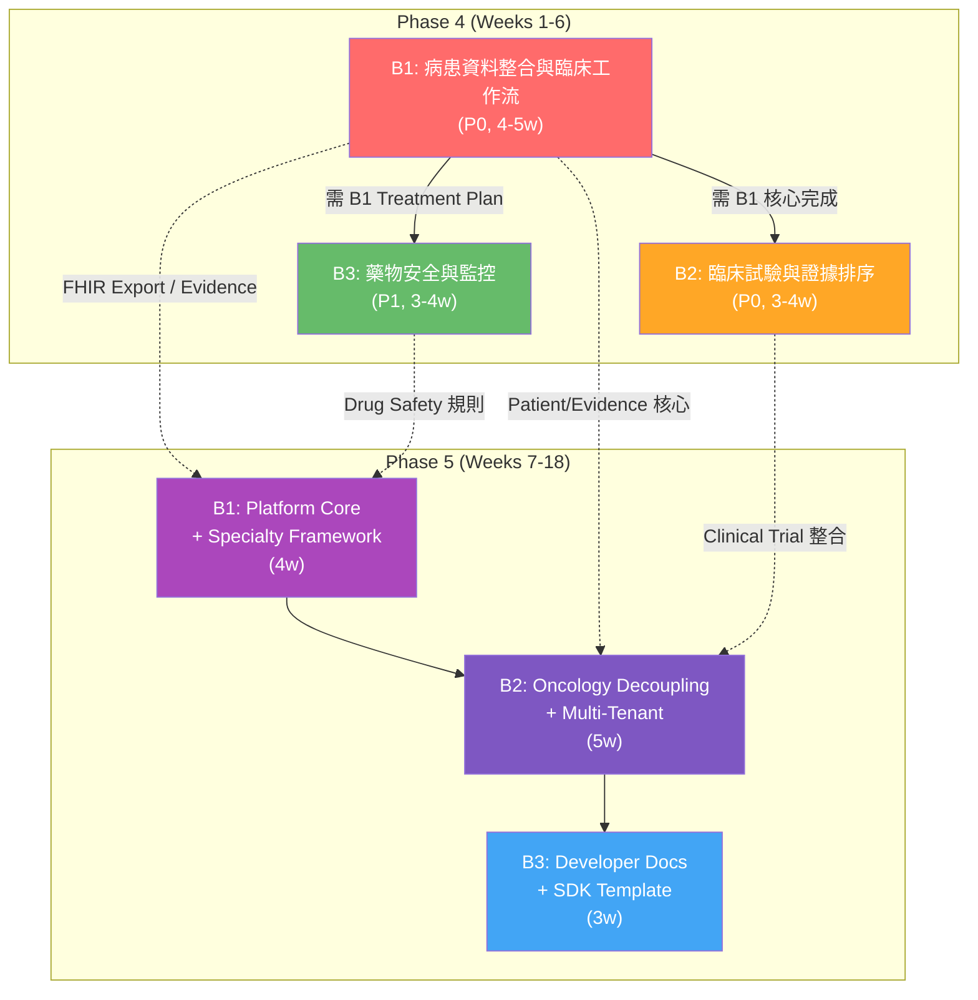

# Phase 4 & Phase 5 Dependency Map

> **產出時間**：2026-08-01  
> **基於文件**：`tasks/plan-phase4-clinical-ai-productization.md`、`tasks/plan-phase5-medical-ai-platform.md`、`tasks/research/phase4-phase5-gap-analysis.md`  
> **負責角色**：doc-writer  

---

## 目錄

1. [依賴分類圖例](#1-依賴分類圖例)
2. [Phase 4 Batch 依賴總圖](#2-phase-4-batch-依賴總圖)
3. [Phase 4 詳細依賴矩陣](#3-phase-4-詳細依賴矩陣)
4. [Phase 5 Batch 依賴總圖](#4-phase-5-batch-依賴總圖)
5. [Phase 5 詳細依賴矩陣](#5-phase-5-詳細依賴矩陣)
6. [Phase 4 → Phase 5 跨期依賴](#6-phase-4--phase-5-跨期依賴)
7. [關鍵依賴鏈（Critical Path）](#7-關鍵依賴鏈critical-path)
8. [並行組合建議](#8-並行組合建議)
9. [風險緩解](#9-風險緩解)
10. [外部標準／資料／安全依賴一覽](#10-外部標準資料安全依賴一覽)
11. [Gap Analysis → Master Plan 對應矩陣](#11-gap-analysis--master-plan-對應矩陣)

---

## 1. 依賴分類圖例

| 標記 | 含義 |
|------|------|
| **🔀 可並行** | 與其他 Batch 無依賴關係，可同時開發 |
| **➡️ 必須串行** | 有嚴格前置依賴，需等前置完成 |
| **🔒 Phase 4 必須完成** | Phase 5 的某些 Batch 必須等 Phase 4 完成 |
| **📅 可延後 Phase 5** | 不影響 Phase 4 交付，可排入 Phase 5 |
| **🌐 外部標準依賴** | 依賴 FHIR/HL7/NCCN 等外部標準或 API |
| **🗄️ 資料依賴** | 依賴特定資料來源或格式 |
| **🔄 Migration 依賴** | 依賴資料庫遷移順序 |
| **🔐 Security 依賴** | 依賴安全審查或授權機制 |

---

## 2. Phase 4 Batch 依賴總圖

```
Phase 4 整體時程預估：10-15 週（3 個 Vertical Slice Batch）
══════════════════════════════════════════════════════════════════

              ┌─────────────────────────────────────────────────┐
              │              Phase 4 啟動 Gate                  │
              │  ┌─ 既有 Phase 3 功能齊全                     │
              │  └─ 所有既有 test suite pass (~148 tests)     │
              └─────────────────────┬───────────────────────────┘
                                    │
         ┌──────────────────────────┼──────────────────────────┐
         ▼                          ▼                          ▼
   ┌──────────────────┐   ┌──────────────────┐   ┌──────────────────┐
   │  B1 ★ 🔀        │   │  B2 ★ 🔀        │   │  B3 ⛓️          │
   │ 病患資料整合      │   │ 臨床試驗與證據排序 │   │ 藥物安全與監控    │
   │ 與臨床工作流      │   │                   │   │                  │
   │ Patient Import → │   │ Clinical Trial →  │   │ Drug Safety →   │
   │ Evidence →       │   │ Evidence Ranking →│   │ Interaction →   │
   │ Recommendation → │   │ Recommendation →  │   │ Contraindication→│
   │ Treatment Plan → │   │ Treatment Update →│   │ Treatment Rev. →│
   │ FHIR Export      │   │ CarePlan          │   │ Monitoring →    │
   │                  │   │                   │   │ FHIR Export     │
   └────────┬─────────┘   └────────┬──────────┘   └────────┬─────────┘
            │                      │                       │
            │      ┌───────────────┘                       │
            │      │  (需 B1 的 Patient/Evidence 核心)      │
            │      ▼                                       │
            │  ┌──────────────────┐                        │
            │  │ B2 啟動條件      │                        │
            │  │ B1 完成 Patient │  (需 B1 的 Treatment    │
            │  │ Import +        │   Plan 核心)            │
            │  │ Evidence 系統   │                        │
            │  └──────────────────┘                        │
            │                                              │
            └──────────────────────┬───────────────────────┘
                                   │
                                   ▼
                    ┌──────────────────────────────────┐
                    │       Phase 4 結束 Gate           │
                    │  ┌─ 3 條垂直切片皆完成            │
                    │  ├─ FHIR Export 正常運作          │
                    │  └─ 所有 test suite pass         │
                    └──────────────────────────────────┘

★ = B1/B2 部分重疊（B2 需 B1 核心完成後啟動）
⛓️ = 必須串行（B3 有前置依賴 B1）
🔀 = B2 需 B1 核心（Patient+Evidence），Gate 後啟動
```

### Batch 一覽表

| Batch | 名稱 | 優先級 | 前置依賴 | 可並行關係 | 工時預估 | 主要涵蓋模組 |
|-------|------|--------|---------|-----------|---------|-------------|
| **B1** | 病患資料整合與臨床工作流 | **P0** | 無 | 🔀 與 B2 並行 | 4-5 週 | Patient Import, Evidence, Recommendation, Treatment Plan, FHIR Export |
| **B2** | 臨床試驗與證據排序 | **P0** | B1（Patient + Evidence 核心） | 🔀 B1 核心完成後啟動（Gate），與 B1 剩餘部分並行 | 3-4 週 | Clinical Trial, Evidence Ranking, Recommendation, Treatment Update, CarePlan |
| **B3** | 藥物安全與監控 | **P1** | B1（Treatment Plan 核心） | ➡️ 串行於 B1 之後；🔀 與 B2 並行 | 3-4 週 | Drug Safety, Interaction, Contraindication, Treatment Revision, Monitoring, FHIR Export |

---

## 3. Phase 4 詳細依賴矩陣

### 3.1 B1：病患資料整合與臨床工作流（P0）

| 依賴分類 | 項目 | 說明 |
|---------|------|------|
| 🌐 **外部標準** | FHIR R4 規範 | Patient/Observation/DiagnosticReport/CarePlan 等核心資源結構 |
| 🌐 **外部標準** | SMART-on-FHIR 授權 | 需實作 Standalone Launch flow（EHR Launch 可延後） |
| 🔐 **Security 依賴** | FHIR 端點授權 | FHIR API 端點需整合既有 JWT/RBAC 框架 |
| 🗄️ **資料依賴** | 既有 Domain Model | 需將 PatientModel、CancerCaseModel、TreatmentPlanModel 映射到 FHIR Resource |
| 🗄️ **資料依賴** | Patient Import 資料源 | 支援 HL7 v2 / CSV / FHIR Bundle 等多種匯入格式 |
| 🔄 **Migration 依賴** | 026_fhir_resource_tables | 若需新建 FHIR 專屬資料表，需執行資料庫遷移 |
| 🔄 **Migration 依賴** | Patient 資料表擴充 | 支援更多臨床欄位與 FHIR 映射 |
| 🔀 **可並行** | B2 | B2 Gate = B1 Patient+Evidence 核心完成；B2 啟動後與 B1 剩餘部分（Treatment Plan/FHIR）並行 |

**依賴鏈標記**：B1 → B3（提供 Treatment Plan 核心）  
**輸出**：FHIR Export、Patient API、Recommendation Engine、Treatment Plan CRUD

### 3.2 B2：臨床試驗與證據排序（P0）

| 依賴分類 | 項目 | 說明 |
|---------|------|------|
| 🌐 **外部 API** | ClinicalTrials.gov REST API | 臨床試驗查詢與篩選 |
| 🌐 **外部 API** | CIViC REST API | 變異臨床證據查詢（pipeline/ 有既有實作可參考） |
| 🌐 **外部 API** | DGIdb REST API | 藥物-基因交互查詢（公開 API） |
| 🌐 **外部 API** | OncoTree REST API | 癌症類型本體查詢 |
| 🌐 **外部 API** | MyVariant.info REST API | 變異註釋查詢 |
| 🗄️ **資料依賴** | B1 的 Evidence 系統 | 需 B1 完成 Evidence Item 模型與儲存後方可完整整合 |
| 🗄️ **資料依賴** | B1 的 Patient Model | 需 Patient 資料以進行臨床試驗比對 |
| 🔐 **Security 依賴** | 外部 API key 管理 | 需建立 secrets 管理機制（環境變數或 vault） |
| 🔀 **可並行** | B1（Patient Import + Evidence 核心完成後） | B1 核心模組完成後即可啟動 B2 |

**依賴鏈標記**：B1（核心）→ B2  
**輸出**：Clinical Trial Matching、Evidence Ranking API、CarePlan Integration

### 3.3 B3：藥物安全與監控（P1）

| 依賴分類 | 項目 | 說明 |
|---------|------|------|
| 🌐 **外部 API** | DrugBank / OpenFDA | 藥物交互與禁忌症查詢 |
| 🌐 **外部 API** | PharmCAT | 本地工具，需安裝環境 |
| 🌐 **外部 API** | Ensembl VEP REST API | 變異註釋（pipeline/vep_adapter.py 可參考） |
| 🗄️ **資料依賴** | B1 的 Treatment Plan | 需 B1 完成 Treatment Plan 模型後方可進行藥物安全檢查 |
| 🗄️ **資料依賴** | 既有 Drug Interaction 資料 | pipeline/ 目錄下既有交互檢查邏輯需整合 |
| 🔐 **Security 依賴** | 外部 API key 管理 | DrugBank API 可能需要授權 |
| 💻 **技術依賴** | Redis / ARQ | Background Jobs 用於定期監控與警示 |
| 🌐 **外部服務** | Prometheus + Grafana | Monitoring 儀表板用於藥物安全警報 |
| ➡️ **必須串行** | B1（Treatment Plan 核心） | B1 完成後 B3 方可完整開發 |

**依賴鏈標記**：B1 → B3  
**輸出**：Drug Interaction Checker、Contraindication API、Treatment Revision、Monitoring Dashboard、FHIR Export

### 3.4 Phase 4 共用基礎設施（跨 Batch 共享）

以下基礎設施組件為三個 Batch 共用，建議在 B1 啟動時一併建置或獨立追蹤：

| 基礎設施 | 服務的 Batch | 優先級 | 說明 |
|---------|-------------|--------|------|
| FHIR Export 服務 | B1, B3 | P0 | 兩個 Batch 皆需輸出 FHIR Resource |
| Redis / ARQ Job Queue | B1, B2, B3 | P1 | Evidence Freshness、監控排程等共用 |
| Prometheus + Grafana | B1, B2, B3 | P1 | 各 Batch 共用 metrics 與 dashboard |
| Docker Compose 環境 | B1, B2, B3 | P1 | 整合測試與一鍵部署 |
| CI/CD Pipeline | B1, B2, B3 | P1 | 自動化測試與部署 |
| API 文件與 SDK | B1, B2, B3 | P2 | 共用 API 規範文件 |

### 3.5 Phase 4 額外任務（Gap Analysis 涵蓋）

以下任務分散在 Batch 中或為獨立任務：

| 任務 ID | 名稱 | 優先級 | 前置依賴 | 被依賴 |
|---------|------|--------|---------|--------|
| #16 | Background Jobs/Queue | **P0** | 共用基礎設施 | #10、#17 |
| #10 | Evidence Freshness | P2 | #16 | 無 |
| #17 | Retry/Dead-letter（泛化） | P2 | #16 | 無 |
| #19 | Backup/Restore | **P1** | #16（選擇性） | 上線必要 |
| #20 | Security Gate（SAST/DAST） | **P1** | 無 | 上線必要 |
| #14 | RBAC/ABAC 強化 | **P1** | 無 | 資源層級安全 |
| #3 | Guideline Adapter（NCCN/ESMO） | **P1** | 無 | GuidelineAgent 功能 |
| #5 | Clinical Trial Matching 完成 | **P1** | B2 | TrialAgent 功能 |

---

## 4. Phase 5 Batch 依賴總圖

```
Phase 5 整體時程預估：12-16 週（3 個 Batch）
══════════════════════════════════════════════════════════════════

              ┌─────────────────────────────────────────────────┐
              │           Phase 5 啟動 Gate                     │
              │  ┌─ Phase 4 全部 3 個 Batch 皆完成             │
              │  ├─ B1 病患資料整合與臨床工作流 ✅             │
              │  ├─ B2 臨床試驗與證據排序 ✅                   │
              │  └─ B3 藥物安全與監控 ✅                       │
              └─────────────────────┬───────────────────────────┘
                                    │
                              ┌─────▼─────┐
                              │ B1 ⛓️    │
                              │Platform   │  Week 1-4
                              │ Core +    │
                              │ Specialty │
                              │ Framework │
                              └─────┬─────┘
                                    │
                              ┌─────▼─────┐
                              │ B2 ⛓️    │
                              │Oncology   │  Week 5-9
                              │Decoupling │
                              │+ Multi-   │
                              │Tenant     │
                              └─────┬─────┘
                                    │
                              ┌─────▼─────┐
                              │ B3 ⛓️    │
                              │Developer  │  Week 10-12
                              │ Docs +    │
                              │SDK        │
                              │Template   │
                              └───────────┘

⛓️ = 必須串行（單線：B1 → B2 → B3）
B1 內部子項可部分並行（Registry、Container、Tests 可分工開發）
```

### Batch 一覽表

| Batch | 名稱 | 優先級 | 前置依賴 | 可並行關係 | 工時預估 |
|-------|------|--------|---------|-----------|---------|
| **B1** | Platform Core + Specialty Framework | **P0** | Phase 4 全部完成 | 內部子項可並行（Registry/Container/Tests） | 4 週 |
| **B2** | Oncology Decoupling + Multi-Tenant | **P0** | B1 | ➡️ 串行（B2 需 B1 的 Platform Registry） | 5 週 |
| **B3** | Developer Docs + SDK Template | **P1** | B1, B2 | ➡️ 串行（需 Platform Core 與 Oncology 皆完成） | 3 週 |

---

## 5. Phase 5 詳細依賴矩陣

### 5.1 B1：Platform Core + Specialty Framework（Weeks 1-4）

| 交付項 | 前置依賴 | 依賴分類 |
|--------|---------|---------|
| B1.1 SpecialtyRegistry（專科註冊表） | 無（Phase 4 完成即可） | 🌐 外部：Platform 設計模式 |
| B1.2 AgentRegistry | B1.1 | ➡️ 串行 |
| B1.3 WorkflowRegistry | B1.1 | ➡️ 串行 |
| B1.4 EvidenceSourceRegistry | B1.1 | ➡️ 串行 |
| B1.5 RuleSetRegistry | B1.1 | ➡️ 串行 |
| B1.6 Platform API 端點 | B1.1-B1.5 | ➡️ 串行 |
| B1.7 PlatformContainer + DI | B1.1 | ➡️ 串行 |
| B1.8 Migration：platform_registry_tables | 無 | 🔄 Migration |
| B1.9 Specialty Template（.template/） | B1.1-B1.2 | ➡️ 串行 |
| B1.10 Registry Tests | B1.1-B1.5 | ➡️ 串行 |

**🔒 Phase 4 必須完成**：FHIR Export（P4 B1）、Drug Safety API（P4 B3）、Monitoring Stack（共用基礎設施）

### 5.2 B2：Oncology Decoupling + Multi-Tenant（Weeks 5-9）

| 交付項 | 前置依賴 | 依賴分類 |
|--------|---------|---------|
| B2.1 AbstractCase 介面設計 | B1.1 | ➡️ 串行 |
| B2.2 AbstractConsensus 介面設計 | B1.1 | ➡️ 串行 |
| B2.3 Oncology Domain 抽象化 | B2.1 | ➡️ 串行 |
| B2.4 CancerTypeEnum → Specialty 映射 | B2.1 | ➡️ 串行 |
| B2.5 Oncology Agent 改造（SpecialtyAgentMixin） | B1.2, B2.3 | ➡️ 串行 |
| B2.6 Treatment Rules 提取 | B1.5 | ➡️ 串行 |
| B2.7 Oncology terminology 提取 | B1.1 | ➡️ 串行 |
| B2.8 Tenant Isolation（Middleware + Repository） | B1.1 | 🔐 Security：Multi-tenant 資料隔離 |
| B2.9 TenantAwareRepository | B2.8 | ➡️ 串行；🔄 Migration：加 tenant_id |
| B2.10 Tenant Admin API | B2.8 | 🔐 Security：租戶管理權限控制 |
| B2.11 API v2 端點規劃 | B1.6 | ➡️ 串行 |
| B2.12 回歸測試（確保既有功能不受影響） | B2.1-B2.11 | ➡️ 串行（最終驗證） |

**🌐 外部標準依賴**：ICD-10、SNOMED CT（Oncology 術語映射）  
**🔐 Security 依賴**：Decoupling 過程中不得引入 regression；Tenant Isolation 需安全審查  
**📅 可延後**：B2.10（Tenant Admin API）可延至 Phase 5 後期

### 5.3 B3：Developer Docs + SDK Template（Weeks 10-12）

| 交付項 | 前置依賴 | 依賴分類 |
|--------|---------|---------|
| B3.1 開發者文件（Developer Guide） | B1（全部）, B2（全部） | ➡️ 串行 |
| B3.2 API 文件更新（OpenAPI 3.0） | B1.6, B2.11 | ➡️ 串行 |
| B3.3 SDK Template（Python pypi 套件） | B1.1-B1.7 | ➡️ 串行 |
| B3.4 Specialty Module 建立指南 | B1.9 | ➡️ 串行 |
| B3.5 Migration 指南 | B1.8, B2.9 | ➡️ 串行 |
| B3.6 效能測試報告 | B1, B2 | ➡️ 串行 |
| B3.7 安全審查 | B2.8 | 🔐 Security：最終安全閘門 |
| B3.8 最終驗收測試 | B1, B2 | ➡️ 串行 |

---

## 6. Phase 4 → Phase 5 跨期依賴

### 6.1 依賴矩陣

```
Phase 4 交付項                             Phase 5 依賴的 Batch
══════════════════════════════════════════  ════════════════════════════════
B1 病患資料整合與臨床工作流 ──────────────  B1 (Platform Core 需 FHIR Export)  🟡 Medium
  ├─ Patient Import ─────────────────────  B2.1 (AbstractCase 設計參考)      🟢 Low
  ├─ Evidence 系統 ──────────────────────  B1.4 (EvidenceSourceRegistry)     🟡 Medium
  ├─ Recommendation Engine ──────────────  B2.6 (Treatment Rules 提取)       🟡 Medium
  └─ FHIR Export ───────────────────────  B1 整體 (平台輸出標準)              🟢 Low

B2 臨床試驗與證據排序 ──────────────────  B2.5 (Oncology Agent 改造)         🟢 Low
  ├─ Clinical Trial Matching ───────────  B2.7 (Oncology terminology)        🟢 Low
  └─ CarePlan Integration ──────────────  B2.2 (AbstractConsensus)           🟢 Low

B3 藥物安全與監控 ──────────────────────  B1 (Platform Core 安全監控)         🟡 Medium
  ├─ Drug Interaction API ──────────────  B1.5 (RuleSetRegistry 整合)        🟡 Medium
  ├─ Contraindication API ─────────────  B1.5 (RuleSetRegistry 整合)        🟡 Medium
  ├─ Monitoring Dashboard ─────────────  B1 整體 (平台監控)                   🟢 Low
  └─ FHIR Export (safety) ─────────────  B1 整體 (平台輸出標準)              🟢 Low
```

### 6.2 相依性視覺化

```
Phase 4 (Vertical Slices)           Phase 5 (Platform Evolution)
═══════════════════════════════     ═══════════════════════════════════════

┌──────────────────────────────────┐
│ B1: 病患資料整合與臨床工作流     │
│  ├─ Patient Import              │──→ B1: Platform Core (FHIR Export)
│  ├─ Evidence System             │──→ B1.4: EvidenceSourceRegistry
│  ├─ Recommendation Engine       │──→ B2.6: Treatment Rules 提取
│  └─ Treatment Plan → FHIR       │──→ B1 平台基礎
└──────────────────────────────────┘
         │
         ├──────────────────────────────────┐
         │                                  │
┌────────▼─────────┐              ┌─────────▼─────────┐
│ B2: 臨床試驗     │              │ B3: 藥物安全      │
│ 與證據排序        │              │ 與監控            │
│                   │──→ B2.5     │                   │──→ B1.5
│ Clinical Trial →  │   Oncology  │ Drug Safety →     │   RuleSetRegistry
│ Evidence Ranking →│   Agent     │ Interaction →     │
│ Recommendation →  │   改造      │ Contraindication →│
│ CarePlan          │             │ Treatment Rev. →  │
└───────────────────┘             │ Monitoring →     │
                                  │ FHIR Export      │
                                  └───────────────────┘
```

### 6.3 風險等級說明

| 風險等級 | 條件 | 緩解建議 |
|---------|------|---------|
| 🟡 **Medium** | Phase 4 B1（病患資料整合）未完整交付 → B1 Platform Core 的 FHIR Export 與 Evidence 整合受阻 | Phase 4 優先完成 Patient Import、Evidence System 與 Recommendation Engine |
| 🟡 **Medium** | Phase 4 B3（藥物安全）未完成 → B1 RuleSetRegistry 的規則來源受限 | Phase 4 B3 至少完成 Drug Interaction 與 Contraindication 核心邏輯 |
| 🟢 **Low** | Phase 4 B2（臨床試驗）未完成 → B2 Oncology 改造可先使用 Phase 4 B1 的基礎 | 不阻斷，B2 可先使用既有 Evidence 系統 |
| 🟢 **Low** | Phase 4 共用基礎設施（Monitoring、CI/CD）未完善 → 不影響 Phase 5 功能開發 | Phase 5 初期可逐步補齊 |

---

## 7. 關鍵依賴鏈（Critical Path）

### 7.1 Phase 4 關鍵鏈

```
Phase 4 最長關鍵鏈：B1(4-5w) → B3(3-4w) = 7-9 週（B1→B3 串行鏈）
                 B1(4-5w) → B2(3-4w) = 7-9 週（B1→B2 部分串行）
──────────────────────────────────────────────────────────

鏈路 1（最長關鍵鏈）：7-9 週
  B1(4-5w) ──→ B3(3-4w)
  (B3 需 B1 的 Treatment Plan 核心，為最長路徑)

鏈路 2（次要關鍵鏈）：6-8 週
  B1(3-4w 核心) ──→ B2(3-4w)
  (B2 需 B1 的 Patient Import + Evidence 核心，B1 核心完成即可)

鏈路 3（最短平行鏈）：4-5 週
  B1(4-5w) 單獨路徑（若不考慮 B2/B3 啟動時間）

結論：B1（病患資料整合，4-5 週）為 Phase 4 的關鍵瓶頸
      B2 與 B3 可在 B1 核心發布後並行啟動
```

### 7.2 Phase 5 關鍵鏈

```
Phase 5 最長關鍵鏈：B1(4w) → B2(5w) → B3(3w) = 12 週
─────────────────────────────────────────────────────────

B1(4w) ──→ B2(5w) ──→ B3(3w)
  ↑                    ↑
  │ (B1.8 Migration)   │ (需 B1 + B2 完全完成)
  │                    │
  └── B1 內部子項並行 ──┘

最長路徑：B1 → B2 → B3 = 12 週
次長路徑：B1 → B2 = 9 週（B3 可部分提前準備）

結論：B2（Oncology Decoupling + Multi-Tenant，5 週）為 Phase 5 關鍵瓶頸
      B3 文件/SDK 需等 B1 與 B2 皆完成後方可完整交付
```

### 7.3 跨 Phase 關鍵鏈

```
跨 Phase 最長關鍵鏈：19-25 週
──────────────────────────────────────────────────────────

Phase 4                        Phase 5
══════════════════════════════  ═══════════════════════════════
B1(4-5w) ──→ B3(3-4w)
                │                B1(4w) ──→ B2(5w) ──→ B3(3w)
                └── B2(3-4w) ──→ (並行)

Phase 4 完成 (7-9w) + Phase 5 完成 (12w) = 19-21 週 (B1→B3→P5)
但若 B2 與 B3 並行：
  最短：7w (Phase 4) + 12w (Phase 5) = 19 週
  最長：9w (Phase 4) + 12w (Phase 5) = 21 週

取決於：
1. Phase 4 B1 核心模組完成速度（決定 B2/B3 啟動時間）
2. Phase 5 B2（Oncology Decoupling + Multi-Tenant）的複雜度
3. Phase 4 共用基礎設施（Monitoring、CI/CD）是否在 B1 中一併交付
```

---

## 8. 並行組合建議

### 8.1 Phase 4 並行組合

| 組合 | 任務 | 分配給 | 預估工時 | 說明 |
|------|------|--------|---------|------|
| **組 A** | B1（病患資料整合與臨床工作流）核心 | 後端工程師 ×3 + QA | 3-4 週 | 含 Patient Import、Evidence System、Recommendation Engine 核心 |
| **組 B** | B1 FHIR Export + 基礎設施 | 後端工程師 ×2 + DevOps | 2-3 週 | 與組 A 並行開發 FHIR Export、Migration 與共用基礎設施 |
| **組 C** | B2（臨床試驗與證據排序） | 後端工程師 ×2 + 領域專家 | 3-4 週 | 需組 A 完成 Patient + Evidence 核心後啟動 |
| **組 D** | B3（藥物安全與監控） | 後端工程師 ×2 + 藥學領域專家 | 3-4 週 | 需組 A 完成 Treatment Plan 核心後啟動；可與組 C 並行 |

**最佳並行策略**：
```
Week 1-2:  組 A ──────────  (B1 核心：Patient + Evidence + Treatment Plan)
Week 1-2:  組 B ──────────  (B1 FHIR Export + 基礎設施)
Week 3-5:           組 C ──────────────  (B2 臨床試驗)
Week 3-5:           組 D ──────────────  (B3 藥物安全)
Week 5-6:                     整合測試與修正
```

### 8.2 Phase 5 並行組合

| 組合 | 任務 | 分配給 | 預估工時 | 說明 |
|------|------|--------|---------|------|
| **組 A** | B1（Platform Core + Specialty Framework） | 架構師 + 後端工程師 ×3 | 4 週 | Registry 設計為核心；內部子項可分工並行 |
| **組 B** | B2（Oncology Decoupling） | 架構師 + 後端工程師 ×3 | 3 週 | 需組 A 完成 B1.1 後啟動；AbstractCase 與 Oncology 抽象化 |
| **組 C** | B2（Multi-Tenant） | 後端工程師 ×2 + Security | 2 週 | 需組 A 完成後啟動；可與組 B 部分並行 |
| **組 D** | B3（Developer Docs + SDK Template） | Tech Writer + 後端工程師 ×2 | 3 週 | 需組 A + 組 B + 組 C 完成後啟動 |

**最佳並行策略**：
```
Week 1-4:  組 A ────────────────────────────
Week 2-5:           組 B ──────────────────────
Week 4-6:                    組 C ──────────
Week 5-7:                          組 D ────────────
```

### 8.3 子代理拆分建議

| 子代理 | 負責範圍 | 所需技能 |
|--------|---------|---------|
| **Sub-agent 1: Patient/Evidence** | Phase 4 B1 核心（Patient Import、Evidence System） | Python, FHIR R4, HL7 互通性 |
| **Sub-agent 2: Treatment Plan/FHIR** | Phase 4 B1（Treatment Plan、Recommendation Engine、FHIR Export） | Python, FHIR R4, 臨床工作流 |
| **Sub-agent 3: Clinical Trials** | Phase 4 B2（Clinical Trial Matching、Evidence Ranking、CarePlan） | Python, REST API, 臨床試驗資料 |
| **Sub-agent 4: Drug Safety** | Phase 4 B3（Drug Interaction、Contraindication、Monitoring） | Python, 藥物資料庫, Redis/ARQ |
| **Sub-agent 5: Platform Core** | Phase 5 B1（SpecialtyRegistry、AgentRegistry、PlatformCore） | Python, 註冊表模式, DI |
| **Sub-agent 6: Oncology/Multi-Tenant** | Phase 5 B2（Oncology Decoupling + Multi-Tenant） | Python, 重構, 抽象化設計, Security |
| **Sub-agent 7: Docs/SDK** | Phase 5 B3（Developer Docs、SDK Template） | Tech Writing, Python, API 文件 |

---

## 9. 風險緩解

### 9.1 關鍵鏈風險

| # | 風險 | 影響的 Batch | 等級 | 緩解措施 |
|---|------|-------------|------|---------|
| R1 | **FHIR R4 規格複雜度**導致 Phase 4 B1 延長至 >5 週 | Phase 4 全部（B2/B3 被延遲） | 🟠 High | 1. 先實作唯讀端點，寫入端點延後<br>2. 使用 FHIR 官方測試套件驗證<br>3. SMART-on-FHIR 只實作 Standalone Launch |
| R2 | **Patient Import 格式多樣**導致 B1 核心延遲 | Phase 4 B1、B2、B3 | 🟡 Medium | 1. 初期先支援 FHIR Bundle 與 CSV 兩種格式<br>2. HL7 v2 可延至 B1 後期<br>3. 使用抽象 Import Adapter 模式 |
| R3 | **ClinicalTrials.gov API 限流**影響 B2 查詢效能 | Phase 4 B2 | 🟡 Medium | 1. 實作快取層減少 API 呼叫次數<br>2. 使用本地備份資料庫作為 fallback |
| R4 | **Drug Interaction 資料不完備**導致 B3 安全檢查不完全 | Phase 4 B3 | 🟠 High | 1. 整合多個藥物資料源（DrugBank + OpenFDA）<br>2. 標記不確定的交互結果需人工覆核 |
| R5 | **Oncology Decoupling 破壞既有功能** | Phase 5 B2 | 🔴 Critical | 1. B2.12 回歸測試為強制 Gate<br>2. 保留 CancerTypeEnum 等原有值為 built-in<br>3. AbstractCase 使用 adaptor pattern 而非修改原 model |
| R6 | **Multi-tenant 設計複雜度**導致 Phase 5 B2 延遲 | Phase 5 B2 | 🟡 Medium | 1. 初期只實作 schema-per-tenant 或 shared-with-tenant_id<br>2. Tenant admin API 延後至 B2 後期<br>3. 資料隔離策略選擇最簡單的方案開始 |
| R7 | **Platform Registry 設計過度工程** | Phase 5 B1 | 🟡 Medium | 1. 先滿足 Oncology 與 Drug Safety 兩個專科需求<br>2. 避免過早抽象化，迭代演進 |
| R8 | **Redis 依賴增加運維複雜度** | Phase 4 共用基礎設施（Job Queue） | 🟡 Medium | 1. 使用 Docker Compose 一鍵啟動 Redis，降低部署門檻<br>2. 初期不要求叢集，單實例即可<br>3. 可選用 Upstash/Railway 等託管 Redis 服務 |
| R9 | **ARQ worker 穩定性與生態限制** | Phase 4 共用基礎設施（Job Queue） | 🟡 Medium | 1. ARQ 足以支撐 Phase 4 需求（非同步任務量不大）<br>2. 將 Retry/Dead-letter 策略封裝為抽象層，未來可遷移至 Celery<br>3. Worker crash 時由 Docker restart policy 自動重啟 |
| R10 | **Queue 資料持久化風險**（Redis 重啟導致任務遺失） | Phase 4 共用基礎設施、#10、#17 | 🟡 Medium | 1. Redis 啟用 RDB/AOF 持久化<br>2. 重要任務（Evidence Freshness）實作 job 完成標記，允許重新排程<br>3. Scheduler 在 worker 啟動時掃描遺漏的定期任務並補執行 |

### 9.2 跨 Phase 風險

| # | 風險 | 影響範圍 | 等級 | 緩解措施 |
|---|------|---------|------|---------|
| R11 | **Phase 4 延遲交付**壓縮 Phase 5 時程 | Phase 5 全部 | 🟠 High | 1. Phase 4 嚴格控管 scope（3 個 Vertical Slice 不擴充）<br>2. Phase 5 B1（Platform Core）可與 Phase 4 尾聲並行啟動<br>3. Phase 5 啟動 Gate 可降低門檻（僅需 Phase 4 B1 + B2 核心完成） |
| R12 | **Clinical Trial 資料源不足**導致 B2 功能受限 | Phase 4 B2、Phase 5 B2 | 🟡 Medium | 1. Phase 4 B2 先以 ClinicalTrials.gov 為主要資料源<br>2. 其他 trial 資料庫可延至 Phase 5 整合 |
| R13 | **Phase 4 B3（藥物安全）延遲**導致 Phase 5 RuleSetRegistry 規則缺乏 | Phase 5 B1.5 | 🟡 Medium | 1. Phase 5 B1.5 先以既有規則為基礎<br>2. B3 完成後再升級規則引擎 |
| R14 | **安全審查阻擋上線** | Phase 4 #20、Phase 5 B3.7 | 🟡 Medium | 1. 安全閘門從 Phase 4 初期就納入 CI<br>2. 避免上線前大量安全修補 |

### 9.3 緩解策略總表

| 策略 | 適用風險 | 具體行動 |
|------|---------|---------|
| **Prototype First** | R1, R2 | 先用 spike 驗證 FHIR mapping 和 Patient Import 格式 |
| **Feature Toggle** | R5, R6 | AbstractCase、Multi-tenant 使用 feature flag 切換，降低風險 |
| **Incremental Delivery** | R5 | Oncology 抽象化分多個小步驟 |
| **Gate Lowering** | R11 | Phase 5 可在 Phase 4 B1 + B2 核心完成後啟動，不須等全部 Batch |
| **Fallback Plan** | R3, R4 | Clinical Trial 和 Drug Interaction 設計備案資料源 |
| **Docker Compose First** | R8, R10 | Redis 及 Background Jobs 使用 Docker Compose 一鍵部署，降低運維負擔 |
| **Abstract Queue Layer** | R9 | 將 job queue 操作封裝為抽象層，保留未來遷移至 Celery 的彈性 |

---

## 10. 外部標準／資料／安全依賴一覽

### 10.1 外部標準依賴（🌐）

| 標準/API | 被依賴的 Batch | 用途 | 必需性 |
|---------|---------------|------|--------|
| FHIR R4 | P4 B1, P4 B3 | 病患資料互通、藥物安全 FHIR Export | **強制** |
| SMART-on-FHIR | P4 B1 | EHR 授權啟動 | 建議 |
| HL7 v2 | P4 B1 | Patient Import 格式（可延後） | 建議 |
| ICD-10 | P5 B2 | Oncology 疾病編碼 | **強制** |
| SNOMED CT | P5 B2 | 臨床術語 | 建議 |
| LOINC | P5 B2 | 檢驗項目編碼 | 建議 |
| ClinicalTrials.gov API | P4 B2 | 臨床試驗查詢 | **強制** |
| CIViC API | P4 B1, P4 B2 | 變異臨床證據查詢 | **強制** |
| DGIdb API | P4 B1 | 藥物-基因交互查詢 | **強制** |
| OncoTree API | P4 B2 | 癌症類型本體查詢 | 建議 |
| MyVariant.info API | P4 B2 | 變異註釋查詢 | 建議 |
| DRKG API | P4 B2 | 藥物重定位知識圖譜查詢 | 建議 |
| Ensembl VEP API | P4 B2 | 變異效應預測 | **強制** |
| PharmCAT | P4 B3 | 藥物基因組學（本地工具） | 建議 |
| DrugBank / OpenFDA | P4 B3 | 藥物交互與禁忌症查詢 | **強制** |
| NCCN API (付費) | P4 #3 | Guideline 查詢 | 建議（備案：PDF） |
| ESMO/ASCO Guideline | P4 #3 | Guideline 查詢 | 建議 |

### 10.2 資料依賴（🗄️）

| 資料源 | 被依賴的 Batch | 用途 |
|--------|---------------|------|
| 既有 Domain Model（PatientModel、CancerCaseModel、TreatmentPlanModel 等） | P4 B1, P4 B3 | FHIR Resource 映射、藥物安全檢查 |
| 既有 Evidence Items | P4 B1, P4 B2 | Evidence 系統參考與 Trial 比對 |
| ClinicalTrials.gov 資料快取 | P4 B2 | 臨床試驗離線查詢備份 |
| DrugBank / OpenFDA 資料 | P4 B3 | 藥物交互檢查資料源 |
| FHIR 測試樣本（public） | P4 B1 | 整合測試 |

### 10.3 安全依賴（🔐）

| 安全項目 | 被依賴的 Batch | 說明 |
|---------|---------------|------|
| JWT + RBAC（既有） | P4 B1 FHIR 端點 | FHIR API 需既有 RBAC 框架保護 |
| SMART-on-FHIR 授權 | P4 B1 | EHR 整合專用授權流程 |
| API Key 管理 | P4 B2, P4 B3 | 外部 API 憑證安全儲存（ClinicalTrials.gov、DrugBank 等） |
| SAST/DAST（Semgrep/Bandit） | P4 #20 | CI 中安全掃描 |
| Tenant Isolation | P5 B2 | Multi-tenant 資料隔離（B2 子項） |
| Tenant Admin 權限 | P5 B2.10 | 租戶管理 API 權限控制 |

### 10.4 Migration 依賴（🔄）

| Migration | 所屬 Phase | 被依賴的 Batch |
|-----------|-----------|---------------|
| 026_fhir_resource_tables | P4 B1 | P4 B1（若需新建 FHIR 表） |
| 026_platform_registry_tables | P5 B1.8 | P5 B1.1-B1.5 |
| Patient 資料表擴充 | P4 B1 | P4 B1（支援 FHIR 映射） |
| Tenant ID migration | P5 B2.9 | P5 B2.8-B2.9 |

---

## 11. Gap Analysis → Master Plan 對應矩陣

本矩陣將 Gap Analysis 報告（23 個維度）中標記為 Phase 4 範圍的維度，逐一對應到 Phase 4 的各個 Batch，確保無遺漏。

| Gap Analysis 維度 ID | 維度名稱 | Gap 等級 | Phase 4 優先級 | 對應 Batch | 涵蓋說明 |
|---------------------|---------|---------|---------------|------------|---------|
| #1 | RAG／Evidence Retrieval | 🔴 Missing | P0 | **B1** | B1 的 Evidence System 涵蓋證據檢索；RAG 語義搜尋延至 Phase 5 |
| #2 | Clinical Knowledge Graph Retrieval | ✅ Complete | P2（可延後） | — | 既有完整，不納入 Phase 4 Batch；服務化延至 Phase 5 |
| #3 | NCCN/ESMO/ASCO Guideline Adapter | 🟠 Stub | P1 | 額外任務 | 獨立於 Batch 外，在 §3.5 中追蹤 |
| #4 | Literature Evidence Ranking | ✅ Complete | P3（可延後） | — | 既有完整，不納入 Phase 4 |
| #5 | Clinical Trial Matching | 🟡 Partial | P1 | **B2** | 由 B2（臨床試驗與證據排序）完整涵蓋 |
| #6 | Drug Interaction | ✅ Complete | P2（可延後） | **B3** | 由 B3（藥物安全與監控）增強實作 |
| #7 | Contraindication Checking | ✅ Complete | P3（可延後） | **B3** | 由 B3 增強實作 |
| #8 | Explainable AI | ✅ Complete | P3（可延後） | — | 既有完整，不納入 Phase 4 |
| #9 | Citation/Provenance | ✅ Complete | P3（可延後） | — | 既有完整，不納入 Phase 4 |
| #10 | Evidence Freshness | 🟡 Partial | P2 | 共用基礎設施（Job Queue） | 由 Background Jobs Scheduler 驅動定時更新 |
| #11 | FHIR R4 | 🟠 Partial | P0 | **B1** | 由 B1 的 FHIR Export 涵蓋 |
| #12 | Patient Import | 🤔 需分析 | P0 | **B1** | 由 B1 的 Patient Import 子項涵蓋 |
| #13 | Multi-tenant | 🔴 Missing | — | **Phase 5** | 明確排除在 Phase 4 之外 |
| #14 | RBAC/ABAC | 🟡 Partial | P1 | 額外任務 | 獨立於 Batch 外，在 §3.5 中追蹤 |
| #15 | Audit Log | ✅ Complete | P2（可延後） | — | 既有完整，不納入 Phase 4 |
| #16 | Background Jobs / Queue | 🟡 Partial | P0 | 共用基礎設施 | ARQ + Redis + Job API + Scheduler，跨 Batch 共用 |
| #17 | Retry/Dead-letter（泛化） | ✅ Complete（outbox） | P2 | 共用基礎設施（依賴 #16） | 由 Background Jobs 泛化實作 |
| #18 | Monitoring/Metrics | 🟡 Partial | P1 | 共用基礎設施 | Prometheus + OTEL + Grafana，跨 Batch 共用 |
| #19 | Backup/Restore | 🔴 Missing | P1 | 額外任務 | 獨立於 Batch 外，在 §3.5 中追蹤；選擇性依賴 #16 |
| #20 | Security Gate | 🔴 Missing | P1 | 額外任務 | 獨立於 Batch 外，在 §3.5 中追蹤 |
| #21 | Platform Registry（Phase 5） | 🔴 Missing | — | **Phase 5** | 明確排除在 Phase 4 之外 |
| #22 | Specialty Framework（Phase 5） | 🔴 Missing | — | **Phase 5** | 明確排除在 Phase 4 之外 |
| #23 | Oncology Decoupling + Multi-Tenant（Phase 5） | 🤔 需分析 | — | **Phase 5** | 明確排除在 Phase 4 之外 |

> **說明**：「額外任務」表示該維度雖在 Phase 4 範圍內，但因不屬於任一 Batch 的垂直範圍，作為獨立任務在 §3.5 中追蹤管理。

---

## 附錄：依賴圖 Mermaid 原始碼



---

> **文件結束** — Phase 4 & Phase 5 Dependency Map
>
> 本圖基於 Phase 4 Master Plan、Phase 5 Master Plan 及 Gap Analysis 報告產出。
> 所有依賴關係均追溯至原始文件的 Batch 定義與前置條件欄位。
